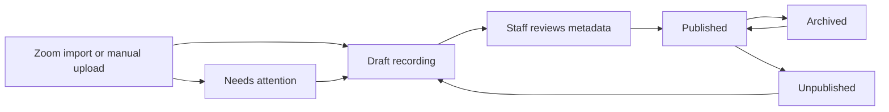
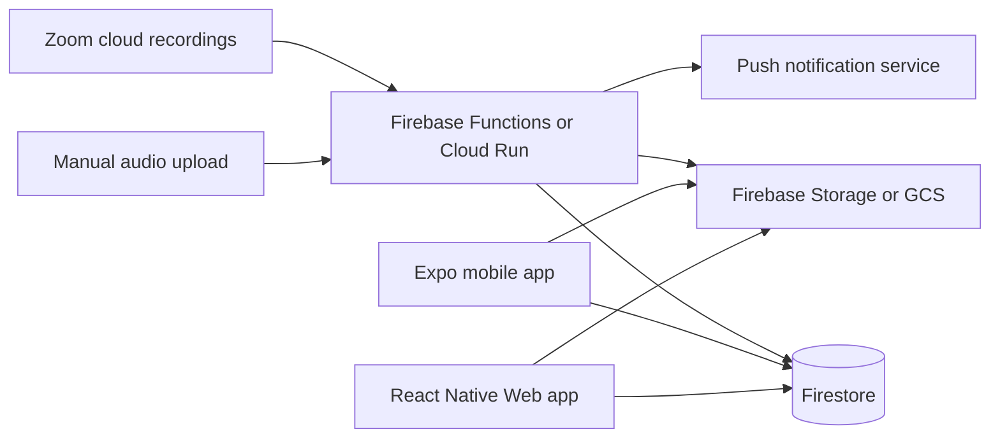

# Hikam Foundations Class Recordings Product Brief

## Summary

Hikam Foundations Class Recordings is a Sabeel Institute mobile and web app for adult students and staff. It replaces manual Zoom link sharing and email-list workflows with a professional recording library, in-app audio listening, and a clear accountability ledger.

The app is not a general LMS. It is a focused platform for class recordings, required listening, and staff visibility into completion.

## Product principles

- **Adult learner tone:** respectful and direct. Use language such as required listening, due, overdue, completed, and pending sync. Avoid childish, punitive, or shaming language.
- **Action first, full data second:** default views should show what needs attention. Complete sortable list views are still available for students and staff when they need full visibility.
- **Access and accountability are separate:** class membership controls access to class recordings. Assignment controls whether a recording is required listening in the accountability ledger.
- **Audio first:** the first release is audio-only. Do not expose Zoom video playback in the MVP.
- **Professional UX:** the app should feel polished, calm, and easy to use for every role. Avoid a wall of recordings as content grows.
- **Sabeel visual system:** use the Sabeel Institute light theme and brand palette through semantic design tokens. Do not introduce a dark mode.

## Planned stack

- Expo and React Native Web for one mobile and web codebase.
- Firebase Authentication, Firestore, Firebase Storage or Google Cloud Storage, Firebase Functions or Cloud Run, and Firebase Secrets or Secret Manager.
- Zoom Server-to-Server OAuth for the primary recording import path.

The product should be designed for Android, web, and future iOS support. Initial builds and testing will target Android and web only because iOS hardware and an Apple Developer account are not available yet. Do not make architectural choices that would block a later iOS build.

## Users and roles

| Role | Description |
|---|---|
| **Admin** | Full platform access across all cohorts, classes, students, recordings, staff, settings, audit history, Zoom source configuration, and destructive actions. |
| **Manager** | Operational staff member assigned class by class. Can manage students, recordings, assignments, reports, and audit history within assigned classes. Cannot manage staff/admin settings or Zoom source configuration. |
| **Student** | Adult learner enrolled in one or more classes. Can access class recordings, listen in-app, download audio inside the app, view progress, and mark recordings complete. |

### Authentication and access

- Staff sign in with Google and must use an `oursabeel.com` account.
- Domain login does not grant staff permissions by itself.
- An Admin must approve staff users and assign Admin or Manager role.
- The first Admin account is seeded during setup or deployment.
- Admins have full platform visibility.
- Managers must be assigned class by class. Cohort-level assignment does not grant access to every class in that cohort.
- Students sign in with email and password.
- Staff quick-create student accounts with full name, email, and enrolled cohort/class.
- After staff create a student account, the student receives an email to set their own password.
- Disabling a student prevents login while preserving all history, enrollments, and reports.

## Academic structure

The primary hierarchy is:

```text
Cohort/Semester -> Course -> Session -> Recording
```

- A **course** is the subject taught over a cohort (formerly "class"; renamed because "class" was overloaded with "class meeting").
- A **session** is one dated meeting of a course. It owns the **attendance** for that meeting and has zero or one recording. A session exists whether or not it was recorded.
- A **recording** is the audio for a session, linked by `recording.sessionId`. It is pure media + lifecycle; the student-facing title/notes/date are copied (denormalised) from the session, because students cannot read sessions.
- A student account can be enrolled in multiple cohorts/courses over time.
- Listening history is preserved across enrollments.
- Admins and Managers can create and manage cohorts, courses, and sessions within their permissions.
- Cohorts are manually marked inactive or archived when they end.
- Courses can be inactive or archived independently.
- A course is effectively active only when both its cohort and the course itself are active.
- Archiving a cohort makes all courses within it effectively inactive.
- Reactivating a cohort restores courses according to each course's own active/archived state.

### Attendance

- Attendance is taken **per session**, in-app, by staff: each enrolled student is marked **present**, **absent**, or **excused**, with an explicit **submit** step. Until attendance is submitted, nobody is assigned even if a recording is published.
- The submitted attendance is a **snapshot**: it drives who is accountable for that session's recording, and it is what makes accountability start at enrollment (a student not enrolled when attendance was taken is simply not in the snapshot).
- `present` exempts a student from the recording (they were there). `absent` and `excused` both make the recording required listening; they differ only for attendance reporting. "Everyone must listen" is expressed by marking everyone absent.
- Attendance is staff-read only. Students never read a session or its attendance — they only ever see their own obligation.

### Archived course access

- Archived courses move out of default student views into history/archive.
- When a course is archived, the default setting is to turn off student access to recordings.
- Staff can explicitly keep archived course recordings available.
- If access is off, students can still see the course/history, but playback is disabled with a clear message.
- When a course is archived, active overdue reminders and active accountability counts stop. Final ledger history remains available for reporting and audit.

## Recording ingestion

The MVP supports two ingestion paths:

1. **Primary:** import audio recordings from an approved Sabeel Zoom source.
2. **Secondary:** manually upload an audio recording when Zoom was not used or did not capture the class.

Both paths produce the same draft recording workflow before publishing.

### Zoom import

- Admins configure the central Sabeel Zoom account or approved connected Zoom source.
- Managers can import recordings from approved Zoom sources for their assigned class scopes.
- Staff see a list of available Zoom cloud recordings.
- The Zoom import picker supports date range, meeting title, import status, and duration filters.
- Already imported Zoom recordings show as imported and link to the existing app recording.
- Failed imports show a needs-attention status with retry and useful error details.
- Drafts prefill title, recording date, duration, and source details from Zoom when available.

### Manual upload

Manual audio upload exists for exceptions, not the normal path. It must still work well.

- Staff can upload an audio file directly.
- Uploaded files become draft recordings.
- Staff must still review and complete app metadata before publishing.
- Manual upload should support clear validation for accepted file types, size limits, upload errors, duration extraction, and retry behavior.

## Recording lifecycle



### Required metadata before publish

Title, date, due date, and shared notes live on the **session**, not the recording — set when the session is created and edited there. So the only thing a recording needs before publish is its **audio**; everything student-facing is inherited from the session it belongs to. (The session's title/notes/date are denormalised onto the recording so students, who cannot read sessions, can still see them.)

Session date defaults to the meeting date. Due date is optional. Notes are visible to everyone who can access the recording — they are not private staff notes. File attachments are out of scope for the first release.

### Recording statuses

- Draft
- Published
- Archived
- Unpublished
- Import failed / needs attention

### Editing published recordings

Staff edit a recording's student-facing metadata (title, date, notes) by editing its **session**; the change propagates to the recording's denormalised copy and is recorded in audit history. A recording belongs to one session for its life — there is no "move to another course" on the recording itself.

Accountability follows the session's attendance, so it is corrected by re-taking attendance (which reconciles assignments), not by editing the recording. Archive hides a recording from default views and preserves history. Unpublish removes current accountability and preserves audit history.

Permanent deletion of recordings, students, courses, or ledger history is Admin-only, requires strong confirmation, and is recorded in the audit log. Normal operations should use disable, archive, or unpublish.

## Assignment, access, and accountability

### Core rule

Course membership grants access to all recordings in that course. **Attendance** creates required listening in the accountability ledger: assignment is attendance-driven.

For a session, the students marked **absent** or **excused** are assigned its recording (it is required listening — they missed the content). Students marked **present** are exempt; they may still listen and their listening is shown to staff, but they are never overdue or flagged incomplete. Assignment happens once the recording is **published** AND attendance has been **submitted**; changing either — publishing, unpublishing, or re-submitting a corrected attendance — reconciles the obligations, deactivating an assignment (while keeping its completion/progress history) if a student is no longer accountable.

There is no separate "assign to everyone" action and no per-recording roster fan-out. "Everyone must listen" is expressed by marking everyone absent for that session.

### Late enrollment

Late-registered students can view all recordings in the course.

Accountability starts at enrollment: a student is only ever accountable for sessions whose attendance was taken **after** they enrolled (they are in that session's snapshot). A student enrolled after a session's attendance was submitted is never retroactively assigned it. To make a late enrollee accountable for an earlier session, staff re-take that session's attendance and mark them absent — re-submitting reconciles and assigns them.

Older accessible recordings that a student is not accountable for appear in the course archive as not required/not assigned. They do not appear in the student's required-listening home list.

Students can listen to and mark accessible unassigned recordings complete. Staff can see this history, but it does not count as required accountability or overdue work.

### Due dates

- Assignments can have a due date or no due date.
- Due dates are date-only, not date-and-time.
- No-due assignments are still required.
- No-due assignments appear under **No due date**.
- No-due assignments never become overdue and do not generate overdue notifications.

## Student experience

### Student home

Student home is task-oriented, not a complete recording archive.

Priority order:

1. Overdue
2. Due soon
3. No due date
4. Completed/recent history

Due soon means incomplete recordings due within the next 7 days.

Students also have complete sortable list views relevant to them, but those are secondary to the default action view.

### Class views

- Active classes appear by default.
- Archived/inactive classes are available through history/archive according to access settings.
- Students can browse class recordings, including older recordings they can access but that are not assigned.
- Unassigned accessible recordings should be labeled clearly as not required/not assigned.

### Playback

Required first-release playback features:

- Audio streaming by default.
- Resume progress.
- Playback speed.
- Background audio.
- Mark complete.
- Optional in-app offline downloads.
- Manual download management with storage usage shown.
- Cross-device progress sync when online.

Students may save audio inside the app for offline listening. The app should not offer external audio file export/download in the first release.

Students manage downloaded recordings manually. Auto-delete policies are not required initially.

### Completion

Completion is student-attested. Playback progress is audit evidence.

- Students manually mark a recording complete.
- The app blocks completion if the student has never played the recording.
- There is no required listened-percentage threshold.
- The ledger shows listened percent, last listened, completion time, and pending sync state.
- Students can see their own full accountability details.
- Students can unmark a recording complete. Completion and uncompletion actions are recorded.

### Offline completion

Students can mark complete offline.

- The app shows **Pending sync** until the completion reaches the server.
- Staff reports treat completion as final only after server sync.
- The app must communicate pending sync clearly to avoid confusion.

## Staff experience

### Staff home and recording library

Staff home starts with the recording library.

The recording library:

- Defaults to active cohorts/classes and non-archived recordings.
- Groups by cohort/semester, then class, then most recent recordings.
- Provides filters for archived and inactive content.
- Shows status counts and needs-attention states so it does not become a wall of recordings.

Staff can play recordings in the app to verify imports and metadata.

### Complete list views

Staff need complete sortable/filterable list views for:

- Recordings
- Students
- Classes
- Ledger/reporting views

Required filters include:

- Cohort
- Class
- Recording status
- Due date/no due date
- Completion status
- Archived state

Search is not required in the first release. The product should rely on hierarchy, filters, sorting, and complete list views.

## Admin backend stats

Admins need an operations/status surface for backend health and usage. This should be Admin-only and focused on practical operating visibility, not analytics for student behavior.

Required backend stats:

- Total audio storage used.
- Storage used by cohort/class where practical.
- Recording count and total audio duration.
- Recent import failures and needs-attention recordings.
- Manual upload failures.
- Recent background job status for Zoom import/sync.
- Push notification delivery/error counts if available.
- Approximate download/playback bandwidth if available from the storage provider.
- Current active users and disabled users by role.

This view should help Admins notice cost, storage, import, and backend issues before they affect students or Managers.

## Accountability ledger

The ledger should help staff find action items without inspecting every student every time.

### Primary views

1. **Recording ledger:** split by the session's attendance — the **accountable** set (absent + excused, with the excused flagged) shown with completion/overdue, and the **attendees** (present) shown with their listening but never overdue or required. A residual "also listened" catches anyone who listened without being accountable or a recorded attendee.
2. **Student ledger:** all assigned recordings for a student, filterable by course and status.
3. **Course-level views:** grouped by cohort/course with incomplete and overdue counts.
4. **Attendance report:** per course, a toggle between a by-session summary (present/absent/excused counts, un-taken sessions flagged) and a by-student summary (attendance tallies + catch-up status: of the sessions each student missed, how many recordings are complete/overdue). CSV export per cut.

### Recording ledger fields

- Student
- Complete/not complete
- Listened percent
- Last listened
- Completed at
- Pending sync where relevant
- Override status/reason where relevant

Default staff workflow should make it easy to filter to not complete or overdue students.

### Staff overrides

Staff can manually override a student's completion status only with a required reason recorded in audit history.

### Exports

CSV export is required for:

- Class ledger views
- Recording ledger views
- Student ledger views

Exports should reflect the same filters used on screen.

## Notifications

Student push notifications are first-class scope.

Default notification behavior:

- Notify when a recording is assigned.
- If overdue, notify the next day.
- Continue daily overdue reminders until the student marks complete.

Students can turn all recording notifications on or off. Notifications are a convenience for students, not the accountability mechanism.

Staff do not need push/email notifications initially. Staff rely on in-app dashboard counts, filters, and ledger views.

## Data policy and audit history

- Recording access state and accountability history are retained indefinitely by default unless an Admin deletes or archives data according to policy.
- Admins and Managers can view audit/change history within their allowed class scopes.
- Platform-level staff/admin changes belong in Admin surfaces.
- Permanent deletion is Admin-only, requires strong confirmation, and is audited.

## Out of scope for the first release

- Transcripts/captions.
- Search.
- Parent/guardian access.
- File attachments.
- Bulk student import.
- Gamification.
- External audio file downloads.
- Video playback.
- Staff push/email notifications.

## Feature checklist

### Student

- Email/password login.
- View active classes.
- View archived/history classes according to access settings.
- See required listening grouped by overdue, due soon, no due date, and recent/completed.
- Browse accessible class recordings.
- Stream audio.
- Download audio inside the app for offline listening.
- Manage downloaded recordings and see storage usage.
- Resume progress.
- Change playback speed.
- Listen in background.
- Mark complete after playing at least once.
- Mark complete offline with pending-sync state.
- Unmark complete.
- View own accountability details.
- Control notification settings.

### Manager

- Google sign-in with approved Manager role.
- Access only assigned classes.
- Create/manage students in assigned classes.
- Quick-create student accounts.
- Import recordings from approved Zoom source for assigned classes.
- Upload audio manually.
- Review drafts and publish recordings.
- Edit published recording metadata.
- Archive/unpublish recordings.
- Listen to recordings.
- View class and recording ledgers.
- Drill into student accountability history.
- Override completion with required reason.
- Export CSV reports.
- View audit history within assigned scopes.

### Admin

- Full platform access.
- Seeded initial Admin account.
- Approve staff and assign Admin/Manager roles.
- Assign Managers class by class.
- Configure approved Zoom source.
- Manage cohorts/classes globally.
- Manage students globally.
- View backend usage and health stats, especially storage usage.
- Perform Admin-only permanent deletion with strong confirmation.
- View platform-level audit history.

## Architecture sketch



## Data model sketch

This is not the final schema. It captures the product objects that need first-class representation.

| Object | Purpose |
|---|---|
| `staffUsers` (`staff`) | Staff identity, role, approval state, and admin/manager permissions. Manager course scoping is `managerUids` on each course, not a separate collection. |
| `students` | Student identity, active/disabled state, and profile fields. |
| `cohorts` | Cohort/semester records and archive state. |
| `courses` | Courses (the subject) inside cohorts, archive state, and archived-access setting. |
| `sessions` | One dated meeting of a course: attendance (present/absent/excused snapshot + submitted marker), date, title, due date, notes, and its 0..1 `recordingId`. Staff-read only. |
| `enrollments` | Student membership in courses over time. |
| `recordings` | Recording asset for a session (`sessionId`), status, source (`manual`/`zoom`), audio path/duration/size, and the denormalised student-facing title/notes/date. |
| `assignments` | Required-listening obligations, one per accountable (absent/excused) student × recording, reconciled from the session's attendance. `active:false` retains history. |
| `listeningProgress` | Playback progress, listened percent, last listened, and device/sync metadata. |
| `completions` / `completionEvents` | Student completion state doc and the append-only event log; `completionOverrides` holds staff overrides (server-only). |
| `notifications` | Student notification preferences and sent notification records. |
| `backendStats` | Admin-facing operational metrics such as storage usage, recording counts, import failures, background jobs, and notification errors. |
| `auditLog` | Staff and system changes that must remain inspectable. |

## Existing research

- [Zoom Server-to-Server OAuth research](research/zoom-server-to-server-oauth.md)
- [Firebase recording cost research](research/firebase-recording-costs.md)
- [Technical risk register](research/technical-risk-register.md)

## Pending external inputs

- Sabeel logo, app icon, splash assets, and any other brand files.
- Firebase/Google Cloud project ownership and configuration.
- Central Sabeel Zoom account or approved Zoom source details.
