# Sabeel Class Recordings — User Manual

*For app version 0.1.0 · July 2026*

Welcome! This guide explains everything the Sabeel Class Recordings app can do —
from listening to your first class to keeping track of who has caught up. It is
organized by role: **students** start with Part 1; **staff** (managers and
admins) add Part 2; **admins** add Part 3. Part 4 is a quick "How do I…?" index
you can skim any time.

The app works the same on the website
(<https://sabeel-class-recordings.web.app>) and the Android app — same account,
same data, live everywhere. Every screen in this guide is shown twice: once **on
a phone** and once **on a computer**, so you can recognize it wherever you are.

---

## The big picture (2 minutes)

1. **Recordings are audio only.** Each one is the sound of a class — no video.
   They stream in the app; nothing is downloaded to fill up your phone, and each
   play link is freshly issued and expires, so recordings stay inside the app.
2. **Being in a class lets you listen; being *assigned* a recording makes it
   required.** Staff enrol you in a class, which opens all of that class's
   recordings to you. When a recording is *required listening*, it also appears
   on your home screen with a due date.
3. **You mark your own listening complete.** The app saves your place and shows
   how much you've heard, but *you* decide when you're done — it is on your
   honor. (The one rule: you have to have pressed play at least once.)
4. **Staff can see who has completed what.** For every required recording there
   is a ledger: who has finished, who hasn't, who is overdue. Staff can export
   it, and — with a written reason — mark a completion on your behalf.
5. **Everything important is written down.** Approvals, overrides and edits are
   recorded in an audit history that admins can review.

That's the whole system. Everything below is detail.

---

# Part 1 — For students

## 1.1 Signing in

<figure class="ph">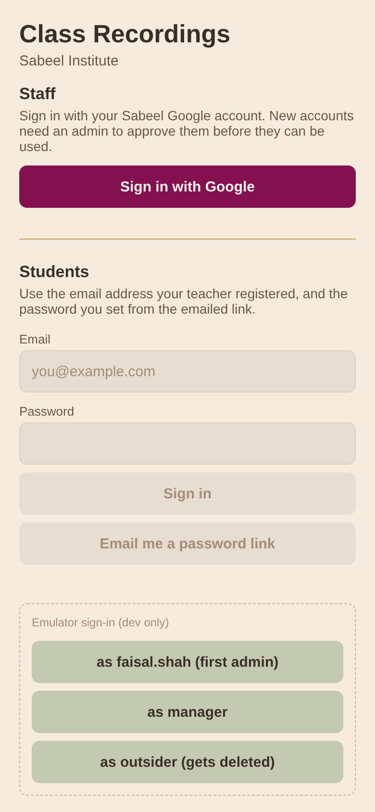<figcaption>On a phone</figcaption></figure>
<figure class="wd">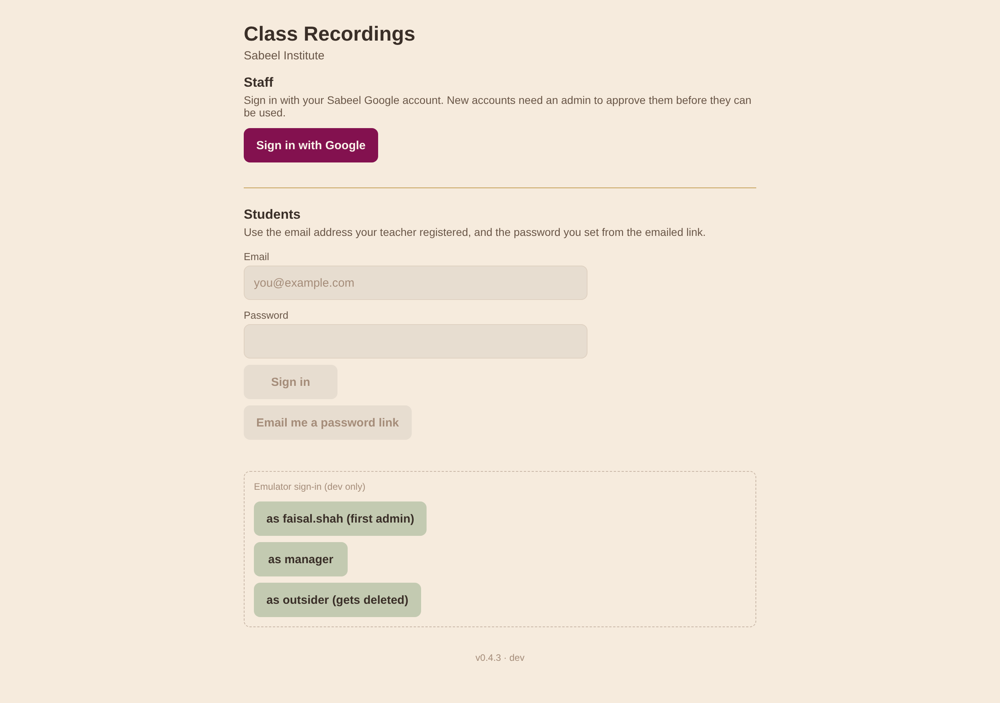<figcaption>On a computer</figcaption></figure>

Open the app or the website. Under **Students**, enter the **email address your
teacher registered** and your password, then tap **Sign in**.

Your first password comes from an email. When your teacher creates your account,
the app sends you a "set your password" link — open it, choose a password, and
you're ready. If you never received it or the link has expired, tap **Email me a
password link** on this screen to get a fresh one.

The **Staff** section at the top is only for teachers and administrators — you
don't need it.

## 1.2 Your listening list

<figure class="ph">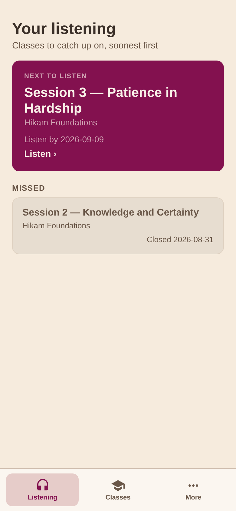<figcaption>On a phone</figcaption></figure>
<figure class="wd">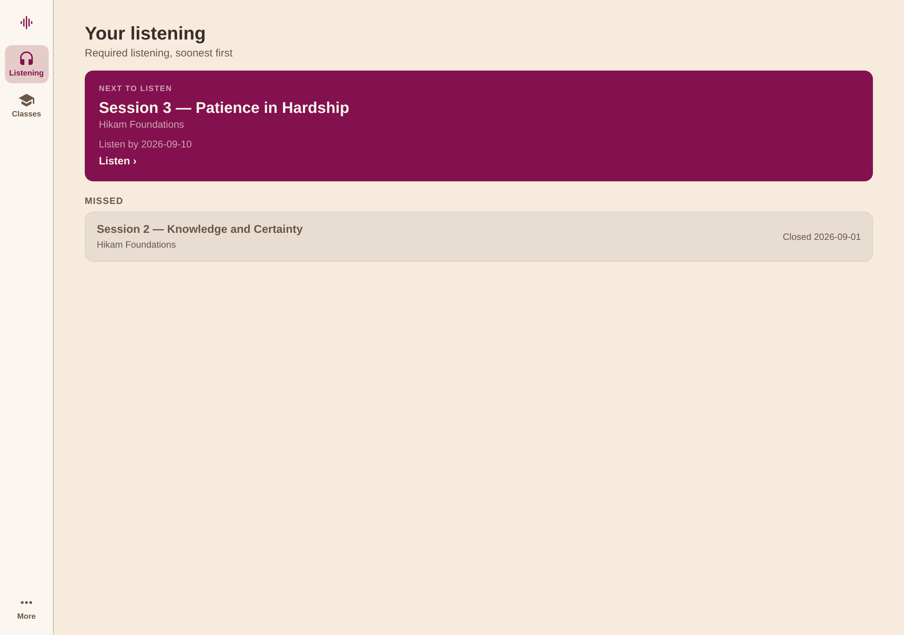<figcaption>On a computer</figcaption></figure>

This is your home screen — **Your listening**, the recordings you've been asked
to listen to, most urgent first. It's grouped so nothing slips past you:

- **Overdue** — required listening whose due date has passed. Shown in red.
- **Due soon** — required, with a due date still ahead.
- **Completed** — recordings you've already marked done.

Each card shows the recording's title, which class it's from, and its due date
(or **Completed**). Tap any card to open it and listen.

If a recording has *no* due date, it's still required, but it waits quietly here
without nagging you — it will show without a date rather than as overdue.

## 1.3 Listening to a recording

<figure class="ph">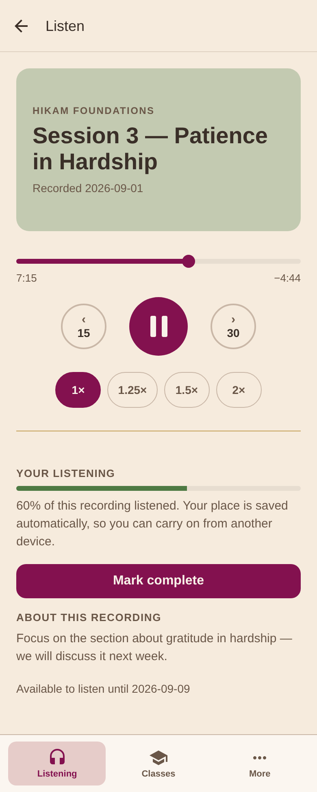<figcaption>On a phone</figcaption></figure>
<figure class="wd">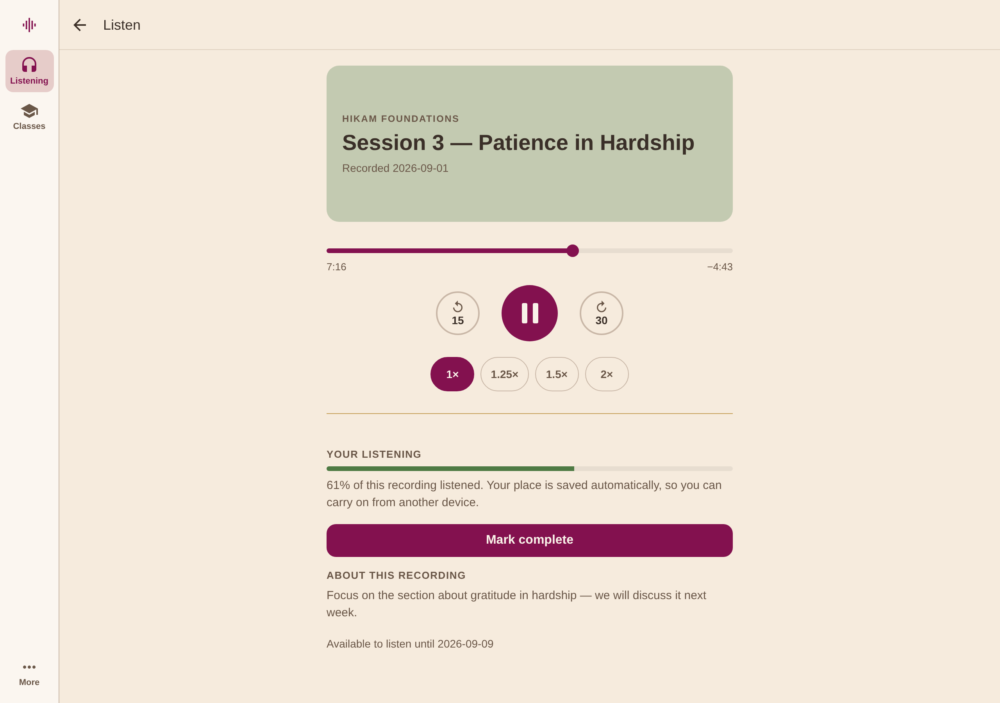<figcaption>On a computer</figcaption></figure>

The player has everything you'd expect from a podcast app:

- **The big round button** plays and pauses.
- The two side buttons **skip back 15 seconds** and **skip ahead 30 seconds** —
  handy for re-hearing a point or moving past a pause.
- **1× / 1.25× / 1.5× / 2×** change the speed without changing the pitch.
- Drag the **progress bar** to jump anywhere. The times below it show how far in
  you are and how much is left.

Under **Your listening**, a bar shows roughly how much of the recording you've
heard. **Your place is saved automatically**, so you can stop on your phone on
the bus and pick up on your laptop at home — it remembers where you were.

If the teacher left a note, it appears under **About this recording** — often
"focus on this part" or "we'll discuss this next week."

## 1.4 Marking a recording complete

The **Mark complete** button is at the bottom of the player. Tap it when you've
finished listening, and the recording moves to your **Completed** section.

A few things worth knowing:

- **It's on your honor.** The app doesn't force you to listen to every second —
  it trusts you to mark complete when you're genuinely done. The listening bar
  is there to help *you* keep your place, not to police you.
- **You do have to press play first.** The button only unlocks once you've
  started the recording — you can't mark something complete you've never opened.
- **Changed your mind?** You can open a completed recording again and listen
  more; marking complete isn't a locked door.

## 1.5 Browsing all your recordings

<figure class="ph">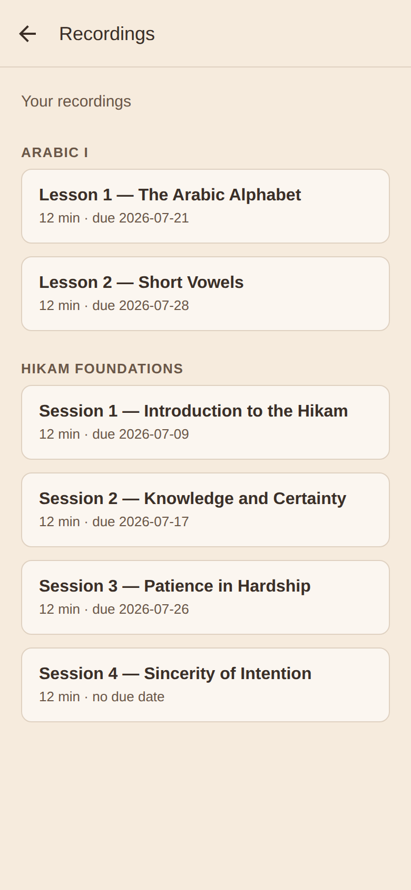<figcaption>On a phone</figcaption></figure>
<figure class="wd">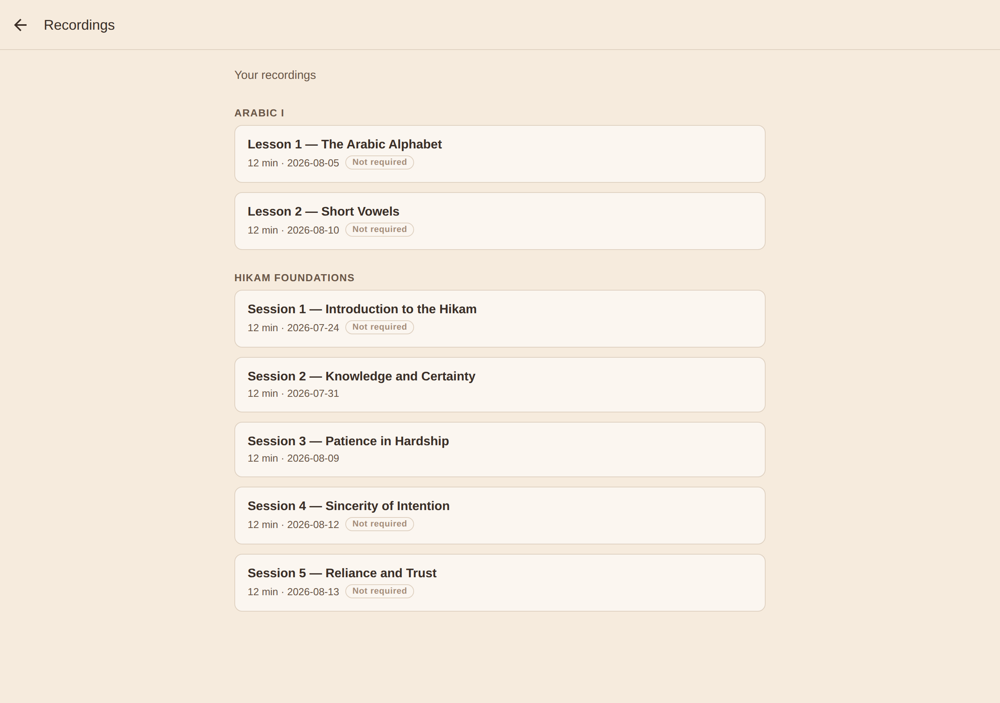<figcaption>On a computer</figcaption></figure>

Your home screen shows what's *required*. But being in a class opens **every**
recording in that class to you — including ones you were never formally asked to
listen to. Tap **Browse all recordings** to see them, grouped by class.

Use this to revisit an earlier session, or to listen to something that isn't
required but you'd like to hear anyway. Listening here is exactly the same — the
same player, the same saved place.

## 1.6 Listening on a spotty connection

The app is built to survive a bad signal. If you mark a recording complete while
you're offline or your connection drops, the app **holds onto that** and syncs it
the moment you're back online — even if you close the app in between. You may
briefly see a "pending" state; that just means "saved on this device, not yet
sent." You don't have to do anything; it sorts itself out.

Streaming the audio itself does need a connection, so for a long class on the go,
a stable network (or Wi-Fi before you leave) is your friend.

---

# Part 2 — For staff

*Managers and admins both use this section. A few actions are admin-only and are
marked; managers see only the classes they've been assigned to.*

## 2.1 Signing in and getting approved

Staff sign in differently from students. On the sign-in screen, use **Sign in
with Google** with your Sabeel Google account.

**The first time, you'll wait for approval.** New staff accounts start as
*pending* — an administrator has to approve you and choose your role before you
can do anything. Once they do, sign in again and you're in. (If you're the very
first administrator, that step was done for you during setup.)

## 2.2 The staff home

<figure class="ph">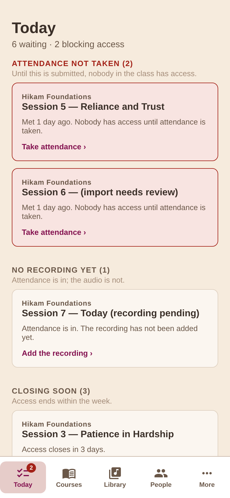<figcaption>On a phone</figcaption></figure>
<figure class="wd">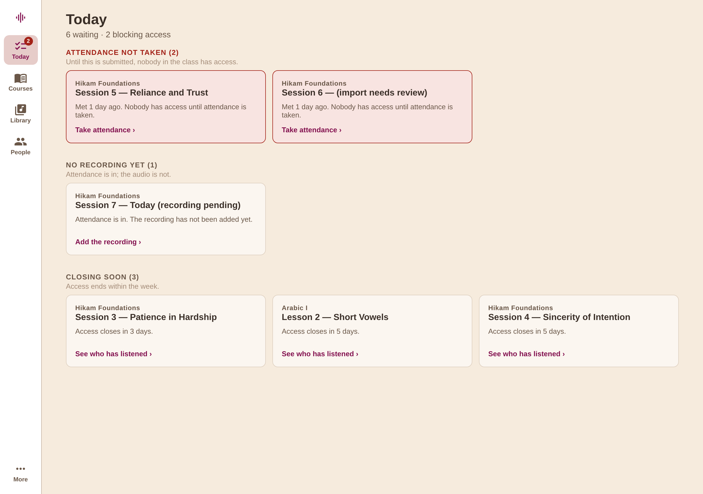<figcaption>On a computer</figcaption></figure>

Your home screen is a hub, grouped into what you **manage** and what you
**report** on:

- **Cohorts & classes** — the heart of the app: terms, classes, recordings, and
  the ledgers that track them.
- **Staff** *(admin only)* — approve new staff and set roles.
- **Students** *(admin only)* — create student accounts and manage access.
- **Recording library** — every recording across every class you can see, with
  filters.
- **Audit history** — the record of who did what.

Managers see a smaller version of this — just what they need for their own
classes.

## 2.3 Cohorts, classes, and a class at a glance

Recordings live inside a **class**, and classes live inside a **cohort** (a term
or intake, like "Autumn 2026"). So you drill down: cohort → class → recordings.

<figure class="ph">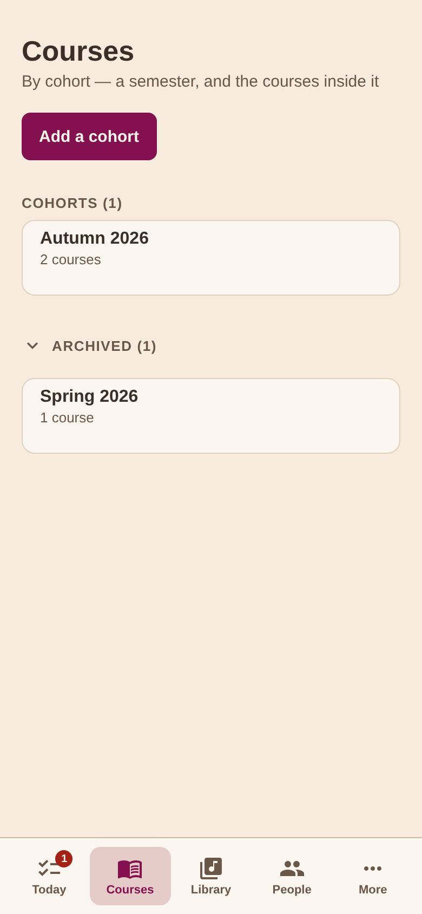<figcaption>On a phone</figcaption></figure>
<figure class="wd">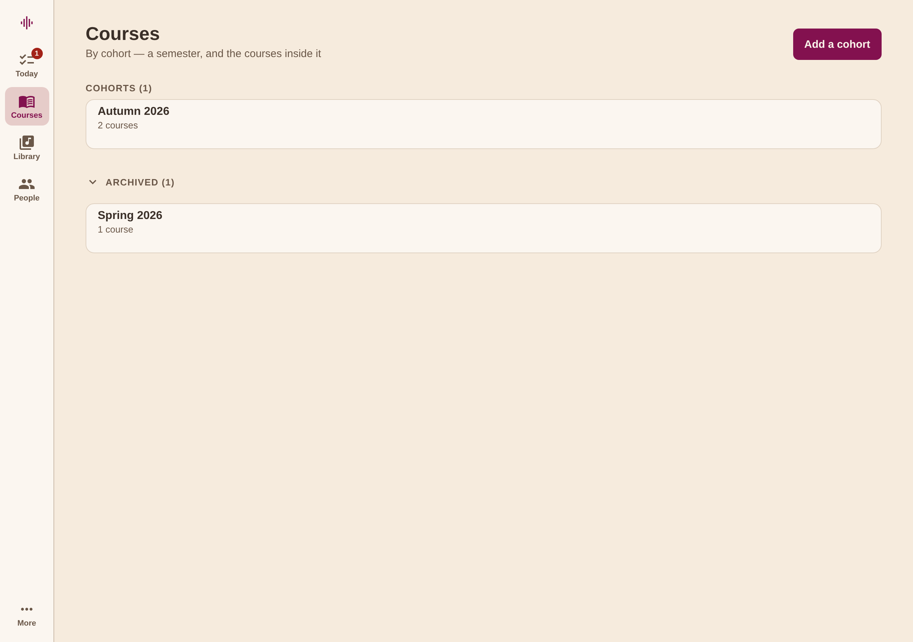<figcaption>On a computer</figcaption></figure>

Open a cohort to see its classes, and open a class to work with it.

<figure class="ph">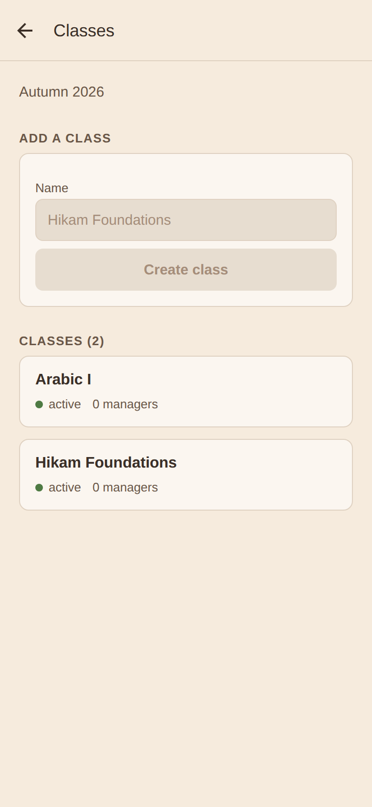<figcaption>On a phone</figcaption></figure>
<figure class="wd">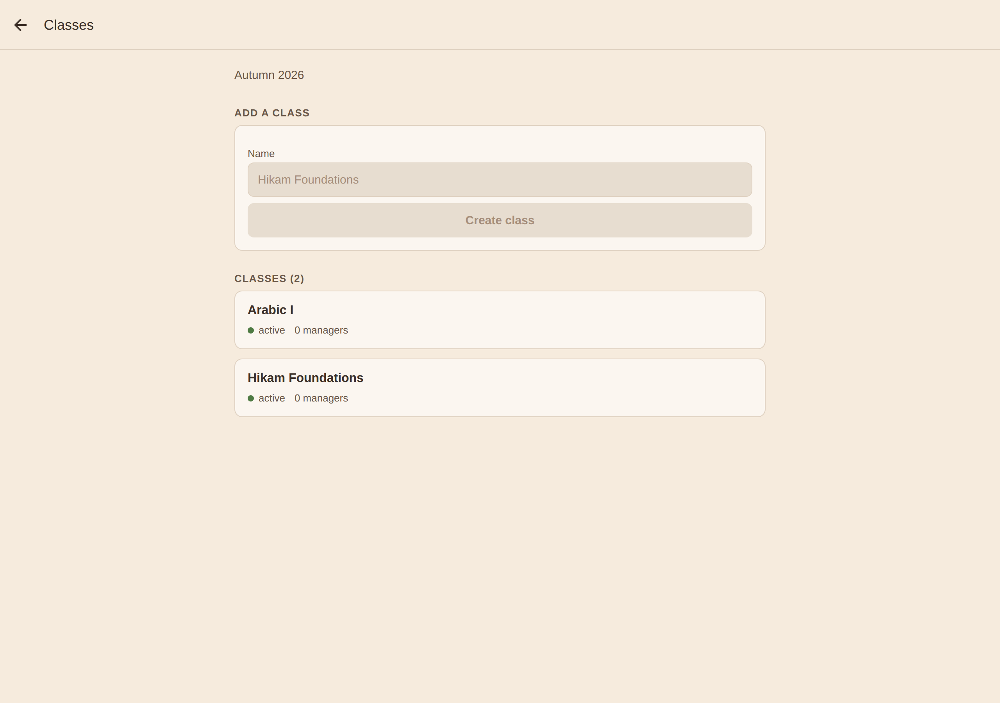<figcaption>On a computer</figcaption></figure>

The **class page** is your dashboard for that class:

<figure class="ph">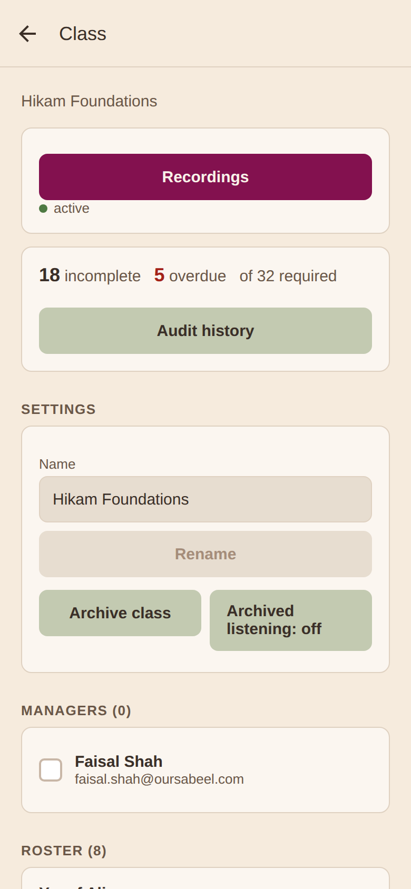<figcaption>On a phone</figcaption></figure>
<figure class="wd">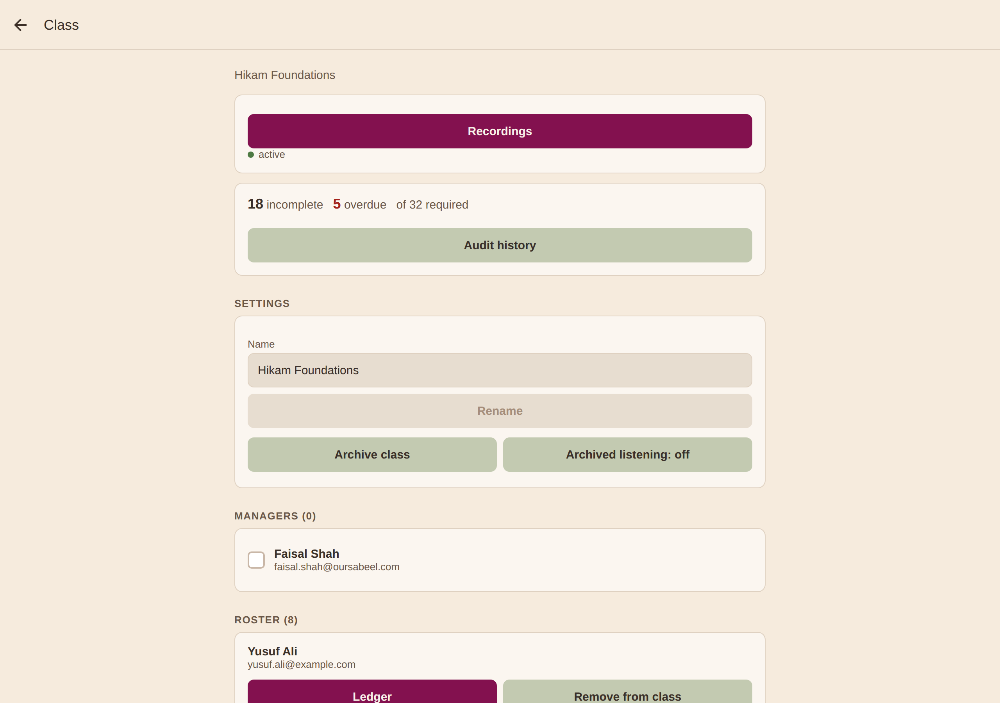<figcaption>On a computer</figcaption></figure>

- **Recordings** takes you to the class's recordings (Section 2.4).
- The counts card — *incomplete / overdue of N required* — is the whole class's
  progress at a glance, and links straight to the class **Audit history**.
- **Settings** lets you rename the class, **archive** it when the term ends, and
  choose whether students may still listen to an archived class's recordings.
- **Managers** lists the staff assigned to *this* class. Managers only ever see
  and act on the classes they're assigned to here — being in a cohort grants
  nothing by itself.
- **Roster** lists the enrolled students. Tap a student to see their personal
  ledger for the class (Section 2.8).

## 2.4 Recordings — add, upload, publish

<figure class="ph">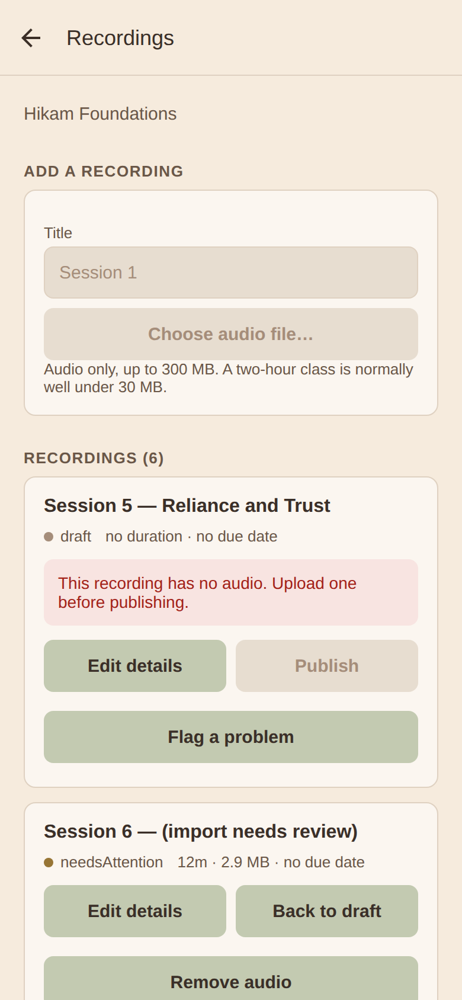<figcaption>On a phone</figcaption></figure>
<figure class="wd">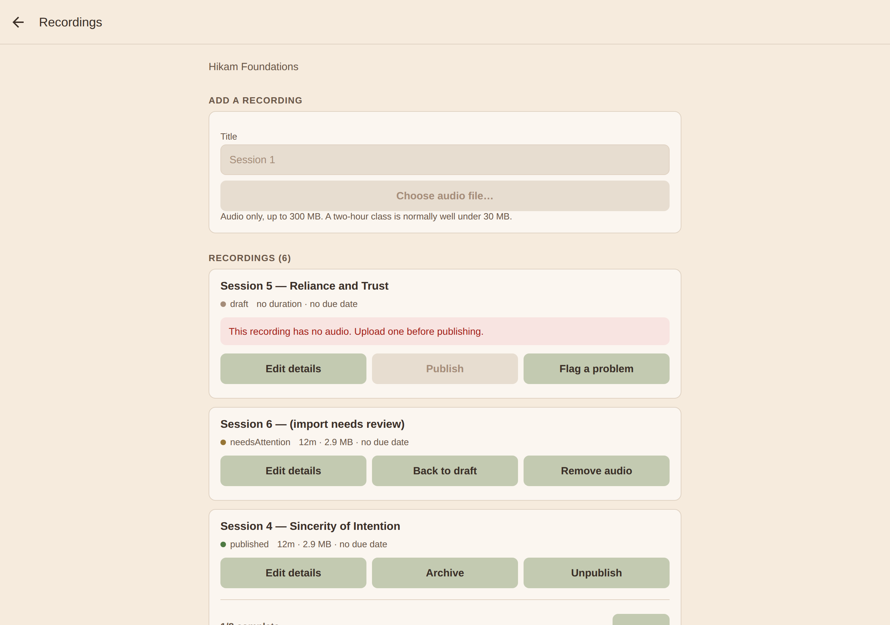<figcaption>On a computer</figcaption></figure>

To add a recording: give it a **title**, then **Choose audio file** and upload
the audio. It's **audio only** — up to 300 MB, though a two-hour class is
normally well under 30 MB. (Uploading audio rather than a video file is the
single biggest thing that keeps this app free to run.)

Each recording moves through a few states, shown on its card:

- **Draft** — created, not yet visible to students. You can upload or replace its
  audio and edit its details freely.
- **Published** — live. Students in the class can listen, and publishing makes it
  **required listening** for everyone on the roster (see 2.5).
- **Needs attention** — flagged for a problem (for example, an import that needs
  review). Use **Flag a problem** to raise this, and **Back to draft** to pull it
  out of students' view while you fix it.

You can't publish a recording with no audio — the app blocks it and reminds you
to upload first. **Edit details** is where you set the title, the teacher's note,
and the due date.

## 2.5 Making a recording required — assignments and due dates

Here's the rule that runs the whole ledger:

> **Publishing a recording assigns it — as required listening — to every student
> currently enrolled in the class.**

That's what makes it appear on students' home screens and puts them on the
recording's ledger. You don't assign students one by one; the class roster is the
assignment.

- **A due date is optional.** Set one in **Edit details** (or leave it blank).
  With a due date, students see "due soon" and then "overdue"; without one, it's
  required but never marked overdue.
- **A student who joins late** wasn't on the roster when you published, so they
  won't automatically be on the older recordings' ledgers. Use **Assign
  catch-up** on a recording to add them (with their own due date) — useful for
  someone catching up on the term.
- **Unpublishing** a recording takes it back out of required listening.

## 2.6 The recording ledger — who has listened

<figure class="ph">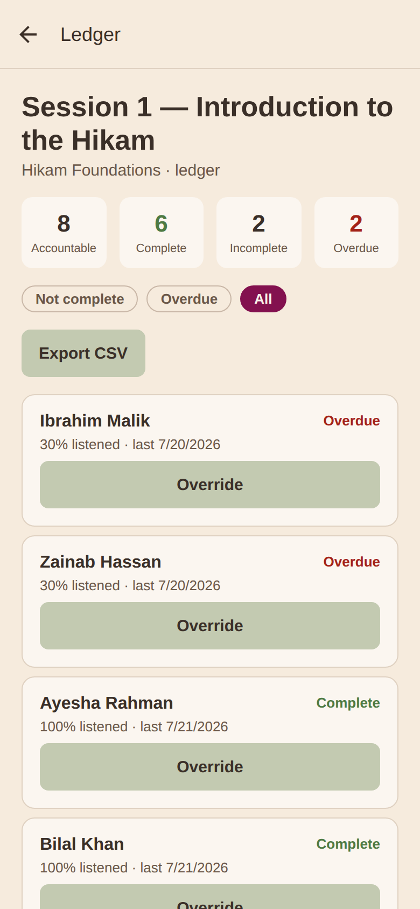<figcaption>On a phone</figcaption></figure>
<figure class="wd">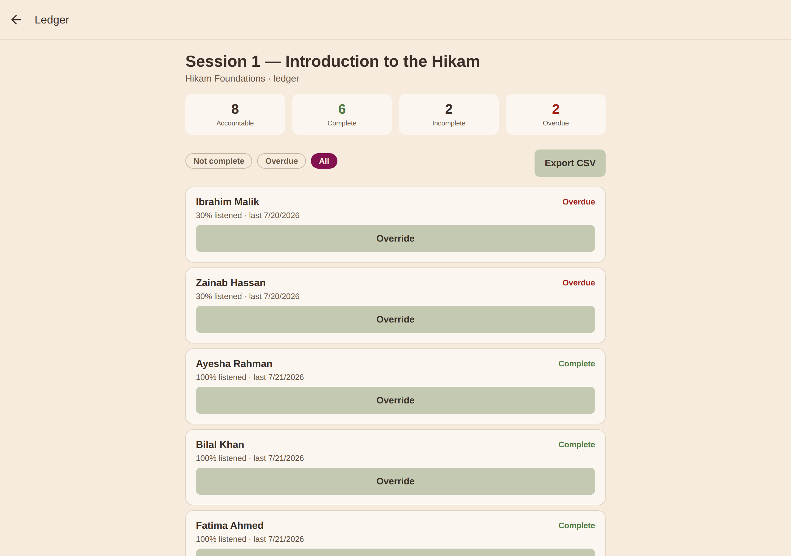<figcaption>On a computer</figcaption></figure>

Open a published recording's **ledger** (from the recordings screen) to see, for
that one recording, exactly where the class stands. Up top, four counts:
**accountable** (the roster on the hook for it), **complete**, **incomplete**,
and **overdue**.

Below, one row per student showing how much they've listened, when they last
listened, and their status — **Complete**, **Incomplete**, or **Overdue**.

- The **filter chips** — *Not complete / Overdue / All* — are action-first. It
  opens on **Not complete**, so you're looking at exactly the people who still
  need a nudge.
- **Export CSV** downloads what's on screen — the same rows, the same filter — as
  a spreadsheet, for records or a follow-up.

A student who listened but was never *required* to (they're not on the roster)
appears separately as "completed, not required" — credit where it's due, without
muddying the accountable count.

## 2.7 Overriding a completion

<figure class="ph">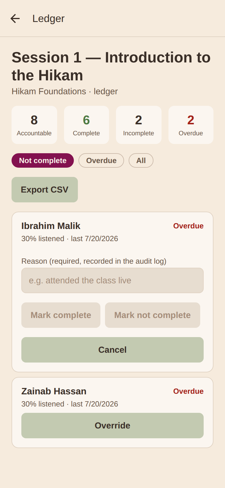<figcaption>On a phone</figcaption></figure>
<figure class="wd">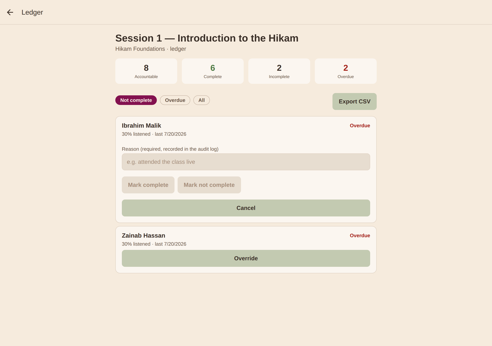<figcaption>On a computer</figcaption></figure>

Sometimes the ledger and reality differ — a student attended the class live, or
listened on someone else's device. Tap **Override** on their row to set the
status yourself:

- Enter a **reason** — it's **required**, and it's written into the audit history
  so there's always a record of why. "Attended the class live; confirmed with the
  teacher" is a good example.
- Choose **Mark complete** or **Mark not complete**.

An override **wins over the student's own mark**. If you mark someone complete and
they later fiddle with their own status, your override stands. To undo it, open
the row again and **Remove override** — the status falls back to whatever the
student's own listening says. Every override, and every removal, is audited.

## 2.8 One student's ledger

From a class's **Roster**, tap a student to see *their* view: the recordings
they're required to complete in that class, each with its status, the same
action-first filters, and its own **Export CSV**. It's the per-person counterpart
to the per-recording ledger in 2.6 — the right screen when a parent or student
asks "where do I stand?"

## 2.9 The recording library

<figure class="ph">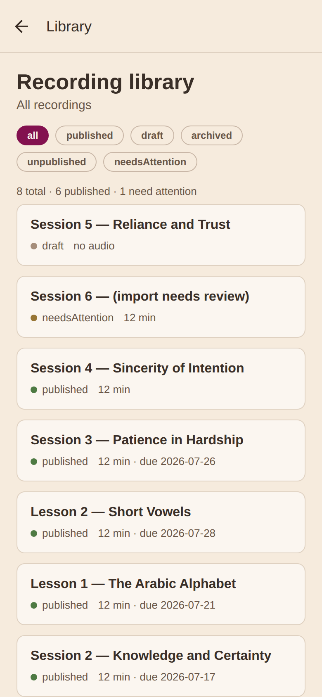<figcaption>On a phone</figcaption></figure>
<figure class="wd">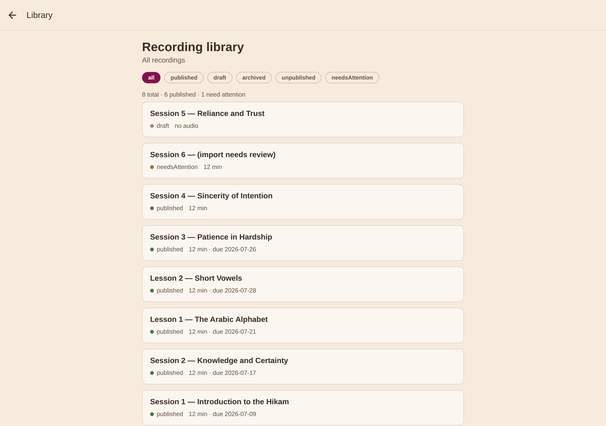<figcaption>On a computer</figcaption></figure>

The **library** is every recording you can see, across all your classes, in one
list — with a count summary and filters for **published / draft / archived /
unpublished / needs attention**. It's the fastest way to answer "which
recordings still need audio?" or "what's flagged?" without walking class by
class. Admins see everything; managers see their assigned classes.

## 2.10 Managing students *(admin)*

<figure class="ph">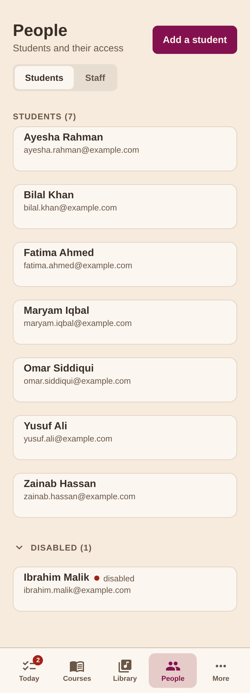<figcaption>On a phone</figcaption></figure>
<figure class="wd">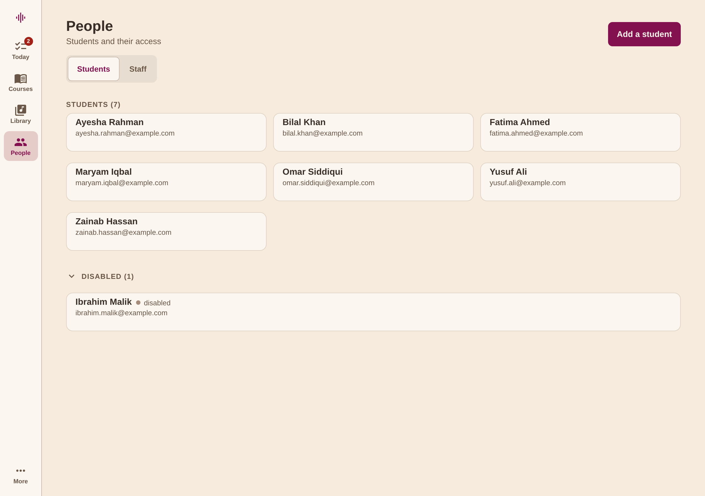<figcaption>On a computer</figcaption></figure>

To add a student, enter their **full name** and **email**, optionally **enrol
them in a class** right away, and tap **Create account**. The app emails them a
link to set their own password — you never handle passwords.

Each student in the list shows whether they're **active** or **disabled**, with
two actions:

- **Resend password link** — if they lost the email or the link expired.
- **Disable** — turns off access without deleting anything. (Disable, don't
  delete — deletion is a separate, deliberate, admin-only step.)

---

# Part 3 — For admins

## 3.1 Approving staff

<figure class="ph">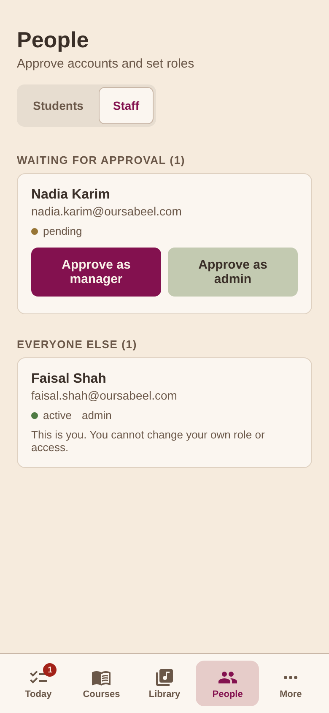<figcaption>On a phone</figcaption></figure>
<figure class="wd">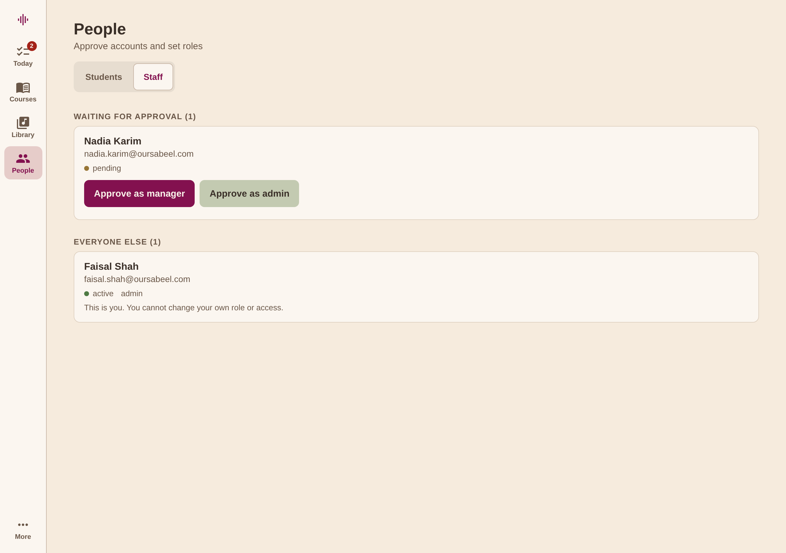<figcaption>On a computer</figcaption></figure>

New staff who sign in with Google land in **Waiting for approval**. For each, you
choose the role as you approve:

- **Approve as manager** — they can run the classes you later assign to them.
- **Approve as admin** — full access, including approving other staff.

Below, **Everyone else** lists active staff. Your own account is marked "This is
you" — you can't change your own role or access, which stops an admin from
accidentally locking themselves out.

Only staff on the institute's own Google domain can be approved at all — the app
checks this on the server, not just in the browser.

## 3.2 Managers are scoped class by class

A manager can't see anything until you give them a class. Do that on the **class
page** (Section 2.3), under **Managers** — add them there, and they'll see that
class's recordings, ledger, and audit, and nothing else. Putting a class in a
cohort a manager works in does *not* grant access; the assignment is always the
specific class.

## 3.3 The audit history

<figure class="ph">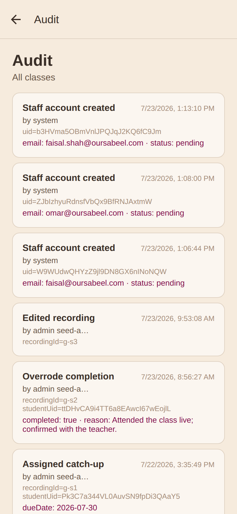<figcaption>On a phone</figcaption></figure>
<figure class="wd">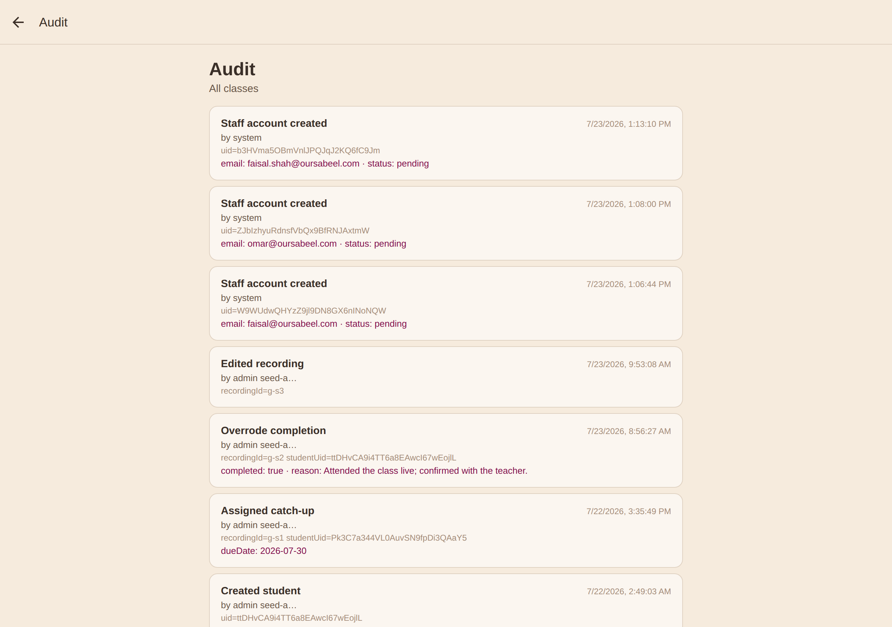<figcaption>On a computer</figcaption></figure>

The **audit history** is the running record of consequential actions — staff
approvals, completion overrides (with their reasons), recording edits, catch-up
assignments — newest first. Each entry shows *who* did *what*, *when*, and the
details that matter.

You can reach it two ways: **globally** from the staff home (admins, all
classes), or **scoped to one class** from that class's page (managers see their
own classes' history). It's there so that "who marked this complete, and why?"
always has an answer.

## 3.4 Disable and archive — don't delete

The app is built around **reversible** actions:

- **Disable** a student or staff member to switch off access while keeping their
  history.
- **Unpublish** a recording to pull it from students without losing it.
- **Archive** a class when a term ends — its history stays intact, and you decide
  whether students may still listen to it.

Permanent deletion exists, but it's deliberately admin-only, asks for strong
confirmation, and is audited. Reach for disable, unpublish, or archive first.

---

# Part 4 — "How do I…?" quick answers

| I want to… | Do this |
|---|---|
| **Listen to a required class** | Home → tap the card → big round button. |
| **Pick up where I left off** | Just reopen it — your place is saved automatically, on any device. |
| **Slow down or speed up** | Tap **1×–2×** on the player. |
| **Mark something done** | Press play once, then **Mark complete** at the bottom of the player. |
| **Find a non-required recording** | Home → **Browse all recordings**, grouped by class. |
| **Set my student password** | Open the emailed link, or tap **Email me a password link** on sign-in. |
| **Add a recording** *(staff)* | Class → **Recordings** → title + **Choose audio file**. |
| **Make a recording required** *(staff)* | **Publish** it — it's assigned to the whole class roster. |
| **Set a deadline** *(staff)* | Recording → **Edit details** → **Due date**. |
| **See who's behind** *(staff)* | Recording → **Ledger** → **Not complete** / **Overdue**. |
| **Give someone credit anyway** *(staff)* | Ledger → **Override** → reason (required) → **Mark complete**. |
| **Add a latecomer to an old recording** *(staff)* | Recording → **Assign catch-up**. |
| **Export for records** *(staff)* | Any ledger → **Export CSV**. |
| **Approve a new teacher** *(admin)* | Home → **Staff** → **Approve as manager / admin**. |
| **Give a manager a class** *(admin)* | Class page → **Managers** → add them. |
| **Create a student** *(admin)* | Home → **Students** → name + email → **Create account**. |
| **See who changed what** *(admin)* | Home → **Audit history**. |

## Troubleshooting

**I signed in but I'm stuck on an "approval" screen.** *(Staff)* New accounts wait
for an admin to approve them. The screen updates by itself the moment they do — no
refresh needed. If you're stuck, contact your administrator.

**A student can't sign in.** Check the email address matches the one on their
account exactly, and use **Resend password link** (Students screen) so they can
set a fresh password. New students have no password until they use that link.

**The audio won't play.** Streaming needs a working connection — try switching
between Wi-Fi and mobile data. Play links refresh automatically, so simply
reopening the recording usually clears a stale one.

**I marked something complete but it still shows incomplete.** If you were
offline, the app is holding your mark and will sync it once you're back online;
it may briefly show as pending. If a *teacher* has overridden your status, their
mark takes precedence — that's by design.

**A manager can't see a class.** Managers only see classes they're assigned to.
An admin adds them under **Managers** on the specific class page — being in the
cohort isn't enough.

**Where did a recording go?** It may have been **unpublished** (back to draft) or
its class **archived**. Both are reversible — check the recordings screen or the
class settings.
