# Sabeel Class Recordings — User Manual

*For app version 0.6.2 · September 2026*

Welcome! This guide explains everything the Sabeel Class Recordings app can do —
from listening to your first class to taking attendance and tracking who has
caught up. It is organized by role: **students** start with Part 1; **staff**
(managers and admins) add Part 2; **admins** add Part 3. Part 4 is a quick "How
do I…?" index you can skim any time.

The app works the same on the website
(<https://sabeel-class-recordings.web.app>) and the Android app — same account,
same data, live everywhere. Every screen in this guide is shown twice: once **on
a phone** and once **on a computer**, so you can recognize it wherever you are.
Both are captures of the website, at a phone's width and a laptop's; the Android
app draws the same screens, minus the one thing Section 2.11 calls out.

---

## The big picture (2 minutes)

1. **Recordings are audio only.** Each one is the sound of one class meeting — no
   video. They stream in the app; nothing is downloaded to fill up your phone,
   and each play link is freshly issued and expires, so recordings stay inside
   the app.
2. **The app is for catching up on a class you were excused from.** Staff take
   **attendance** for each meeting. If they mark you **excused**, that meeting's
   recording opens to you and becomes *required listening* — it appears on your
   **Listening** screen with a date to listen by, and closes again after it. If you were
   **present**, you don't need it. If you were **absent** without being excused,
   it isn't opened to you. Being excused is the whole of it.
3. **You mark your own listening complete.** The app saves your place and shows
   how much you've heard, but *you* decide when you're done — it is on your
   honor. (The one rule: you have to have pressed play at least once.)
4. **Staff can see who has caught up.** For every recording there is a ledger:
   of the students who were excused, who has finished and who missed the date —
   plus, for the record, who was present and who was absent. Staff can export it
   and, with a written reason, mark a completion on someone's behalf.
5. **Everything important is written down.** Approvals, overrides and edits are
   recorded in an audit history that admins can review.

That's the whole system. Everything below is detail.

## Finding your way around

The app has a **bar along the bottom** on a phone and a **narrow strip of icons
down the left** on a computer. It is the same set of places either way, and it
is always there — so wherever you are, you are one tap from anywhere else.

Students have **Listening**, **Classes** and **More**. Staff have **Today**,
**Courses**, **Library**, **People** and **More**.

**More** holds the things you need occasionally rather than daily: notification
settings, the privacy policy, signing out, and — for students — changing your
password. Admins also reach the audit history there.

When something is playing, a slim bar shows what it is with a play/pause button
— above the tabs on a phone, along the foot of the window on a computer. You can
move around the app and it keeps playing; tap the bar to go back to the full
player.

---

# Part 1 — For students

## 1.1 Signing in

<figure class="ph"><figcaption>On a phone</figcaption></figure>
<figure class="wd"><figcaption>On a computer</figcaption></figure>

Open the app or the website. Under **Students**, enter the **email address your
teacher registered** and your password, then tap **Sign in**.

Your first password comes from an email. When your teacher creates your account,
the app sends you a "set your password" link — open it, choose a password, and
you're ready. If you never received it or the link has expired, tap **Email me a
password link** on this screen to get a fresh one.

The **Staff** section at the top is only for teachers and administrators — you
don't need it.

## 1.2 Your listening list

<figure class="ph"><figcaption>On a phone</figcaption></figure>
<figure class="wd"><figcaption>On a computer</figcaption></figure>

This is **Your listening**, the first thing the app opens on. It holds every recording that has
been opened to you, most urgent first.

**A recording is opened to you when your teacher marks you *excused* for that
class.** That is the whole rule. If you were there, you don't need it; if you
missed a class without being excused, it isn't opened to you. So this one list is
both what you *may* listen to and what you *need* to listen to — there is no
separate archive to go hunting through.

**The one to listen to next is at the top, in full.** It is the most urgent
recording still open to you, shown as a large card so there is no hunting on the
screen you open most. Everything else sits underneath it, grouped so nothing
slips past you:

- **Missed** — the date to listen by has passed, with the date it closed.
  Nothing can be done about these, so they are set quietly rather than as an
  alarm.
- **Archived** — the class has been archived and listening turned off, so
  these are no longer required and cannot be played. Quiet, like Missed.
- **Due soon** — the date to listen by is within the next week.
- **Upcoming** — opened to you, with more time.
- **Completed** — recordings you've already marked done.

Each card shows the recording's title, which class it's from, and **Listen by**
its date. Tap any card to open it and listen.

**Every recording has a closing date.** After it passes you can no longer play
that recording — the card stays on your list marked *Missed*, so you can still
see what it was, but the audio is closed. Opening it shows **Your record**: how
much of it you listened to, and whether it was marked complete. Nothing you did
is lost when a recording closes. If you need it reopened, ask your teacher: they
can move the date.

One thing worth knowing: if you finish a recording and mark it complete *before*
the date, it stays **Completed** forever. It is never turned into a "missed" the
next day.

## 1.3 Listening to a recording

<figure class="ph"><figcaption>On a phone</figcaption></figure>
<figure class="wd"><figcaption>On a computer</figcaption></figure>

The player has everything you'd expect from a podcast app:

- **The big round button** plays and pauses.
- The two side buttons **skip back 15 seconds** and **skip ahead 30 seconds** —
  handy for re-hearing a point or moving past a pause.
- **1× / 1.25× / 1.5× / 2×** change the speed without changing the pitch.
- Drag the **progress bar** to jump anywhere. The times below it show how far in
  you are and how much is left.

A bar shows roughly how much of the recording you've heard. **Your place is saved
automatically**, so you can stop on your phone on the bus and pick up on your
laptop at home — it remembers where you were.

If the teacher left a note, it appears under **About this recording** — often
"focus on this part" or "we'll discuss this next week."

<figure class="ph">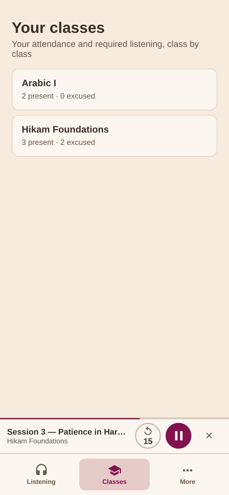<figcaption>On a phone</figcaption></figure>
<figure class="wd">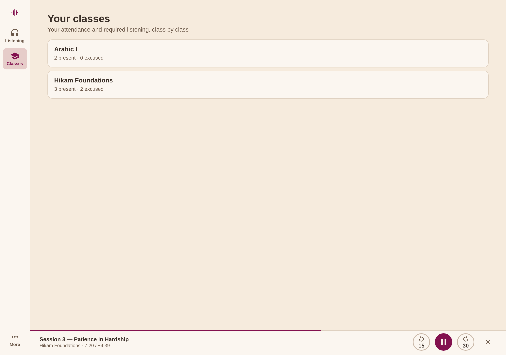<figcaption>On a computer</figcaption></figure>

**You can leave this screen without stopping the audio.** Go and check your
attendance record or open another class — a slim bar keeps showing what's
playing, with play/pause and a 15-second skip back, and tapping it brings you
back here. On a computer that bar carries the skip forward and the times as
well.
Closing it with the **×** is what stops playback.

## 1.4 Marking a recording complete

The **Mark complete** button is at the bottom of the player. Tap it when you've
finished listening, and the recording moves to your **Completed** section.

A few things worth knowing:

- **It's on your honor.** The app doesn't force you to listen to every second —
  it trusts you to mark complete when you're genuinely done. The listening bar
  is there to help *you* keep your place, not to police you.
- **You do have to press play first.** The button only unlocks once you've
  started the recording — you can't mark something complete you've never opened.
- **Changed your mind?** You can open a completed recording again and listen
  more; marking complete isn't a locked door.

## 1.5 Your attendance record

<figure class="ph">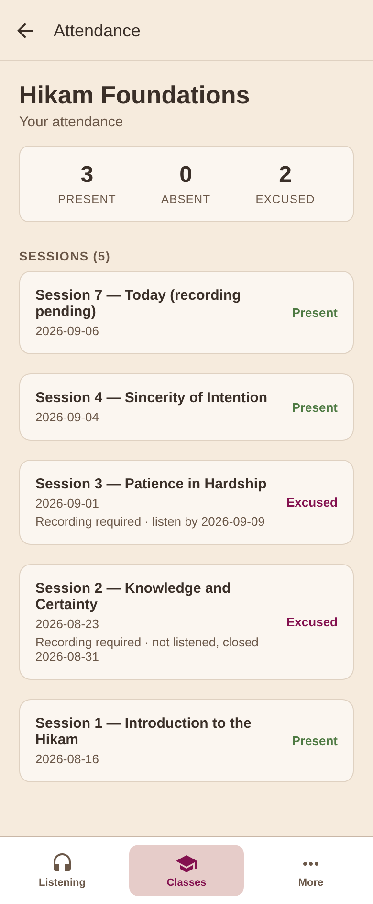<figcaption>On a phone</figcaption></figure>
<figure class="wd">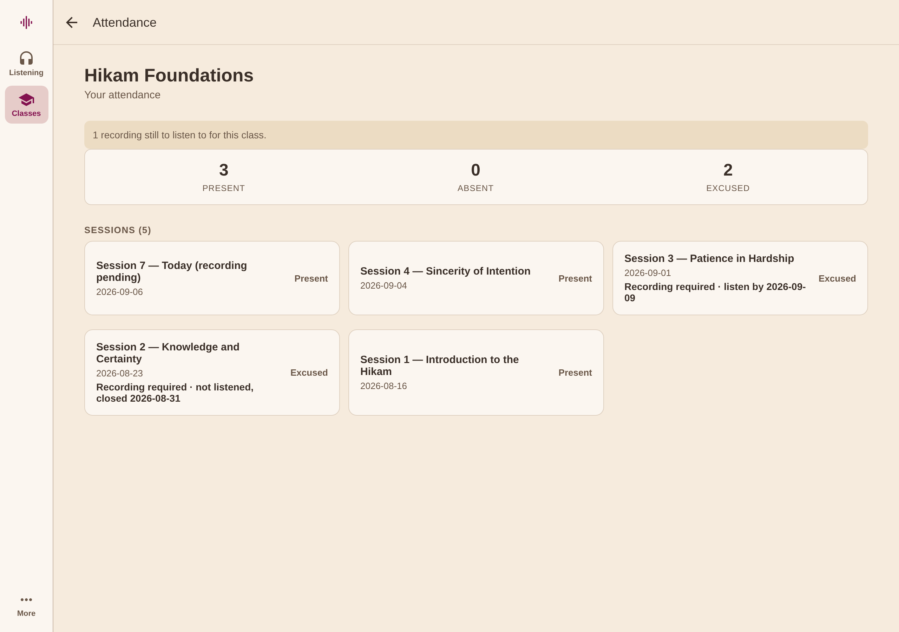<figcaption>On a computer</figcaption></figure>

Tap **Classes** in the navigation to see the classes you're enrolled in — each
one shows your tally at a glance — then tap one to see **your own attendance**
for it.

At the top is a tally — how many meetings you were **present** for, **absent**
from, and **excused** from. Below it, every meeting your teacher recorded you in,
newest first, with the date and your own mark.

Where you were excused, the row also says that a recording was required and
whether you've listened to it — so you can check your record without hunting
through your listening list.

Two things this page is not: it isn't a way to play anything (that's
**Listening**), and it never shows anyone else's attendance. You see your own marks and
nobody else's.

## 1.6 Changing your password

Tap **More**, then **Change password**. The app emails you a link to set a new
one — the same kind of link you used when your account was first created. Your
account is created for you by the institute; you can't sign yourself up, and
there's nothing to create here.

## 1.7 Listening on a spotty connection

The app is built to survive a bad signal. If you mark a recording complete while
you're offline or your connection drops, the app **holds onto that** and syncs it
the moment you're back online — even if you close the app in between. You may
briefly see a "pending" state; that just means "saved on this device, not yet
sent." You don't have to do anything; it sorts itself out.

Streaming the audio itself does need a connection, so for a long class on the go,
a stable network (or Wi-Fi before you leave) is your friend.

## 1.8 Notifications

The app can send you two messages, and only two. Tap **More**, then
**Notifications**, to turn either off:

- **A recording is ready for me** — when a class you were excused from has a
  recording you can listen to. Worth leaving on: it's the only way you'll know
  one has appeared.
- **Last day to listen** — on the morning of the day a recording closes, if you
  haven't finished it.

Both start switched on. There's deliberately no message *after* a recording
closes: by then there'd be nothing you could do about it.

Your choices follow you — they apply on every device you sign in on. Reaching
this device needs its permission as well. The app offers to set that up once, on
your listening screen after you sign in; you can also tap **Enable
notifications** on this screen at any time. If it says they are blocked, use **Open settings** on a
phone, or allow them from the site settings behind the icon in your browser's
address bar. If it says this device can't show them at all, either the browser
doesn't support them or setting them up didn't finish — try again from this
screen, and if it keeps saying that, tell Faisal.

---

# Part 2 — For staff

*Managers and admins both use this section. A few actions are admin-only and are
marked; managers see only the courses they've been assigned to.*

## 2.1 Signing in and getting approved

Staff sign in differently from students. On the sign-in screen, use **Sign in
with Google** with your Sabeel Google account.

**The first time, you'll wait for approval.** New staff accounts start as
*pending* — an administrator has to approve you and choose your role before you
can do anything. The screen updates by itself the moment they do; you do not
need to sign in again. (If you're the very first administrator, that step was
done for you during setup.)

## 2.2 Today — what's waiting

<figure class="ph"><figcaption>On a phone</figcaption></figure>
<figure class="wd"><figcaption>On a computer</figcaption></figure>

The app opens on **Today**: everything across your courses that is waiting on
you, most urgent first. Every card is a link straight to the screen where you do
the thing.

- **Attendance not taken** — a class has met and nobody has submitted the
  register. This is first and it's the one entry the screen tints, because until
  it's submitted **nobody in that class has access to the recording** — and
  nothing else on any screen would tell you.
- **Waiting to publish** — a recording is added but not out: still a draft, an
  import that needs attention, or one that was published and has since been
  unpublished or archived.
- **No recording yet** — attendance is in, the audio isn't.
- **Closing soon** — access to a recording ends within the week; a good moment
  to see who still hasn't listened.

The number on the **Today** tab counts what is blocking access right now: a
register not yet submitted, and a recording that was published and has since
been taken back — unpublished, or archived before its Listen by date. A
draft that has never been published is waiting on you but is blocking nobody, so
it is in the list without being in the count. Archiving *after* the Listen by
date took nothing away from anyone, so it is simply filing and says nothing
here.

If you run more courses than one screen can watch at once, Today says so above
the list — the rest are still there under **Courses**, they are just not in this
count.

A card disappears the moment you close the gap, and the count goes with it. An
empty Today is the answer, not a blank screen: it means attendance is in, every
recording is published, and nothing closes this week.

The rest of the navigation is the structure: **Courses** (cohorts and their
courses for an admin, your own courses for a manager), **Library**, **People**,
and **More**.

## 2.3 Cohorts, courses, and a course at a glance

The structure is **Cohort → Course → Session → Recording**. A **cohort** is a
term or intake (like "Autumn 2026"). A **course** is a subject taught over that
term. A **session** is one dated meeting of the course, and a **recording** is
the audio of that meeting.

<figure class="ph"><figcaption>On a phone</figcaption></figure>
<figure class="wd"><figcaption>On a computer</figcaption></figure>

Finished terms move into an **Archived** section at the bottom of the cohort
list — tap the heading to open it.

Open a cohort to see **its settings and its courses**, and open a course to work
with it. The cohort's settings are where you **rename** it — change the name and
tap **Rename** — and where you **archive** it, in the same way a course is
renamed and archived from the course page. Archiving a cohort turns off every
course in it; reactivating puts each course back to the setting it had.

<figure class="ph">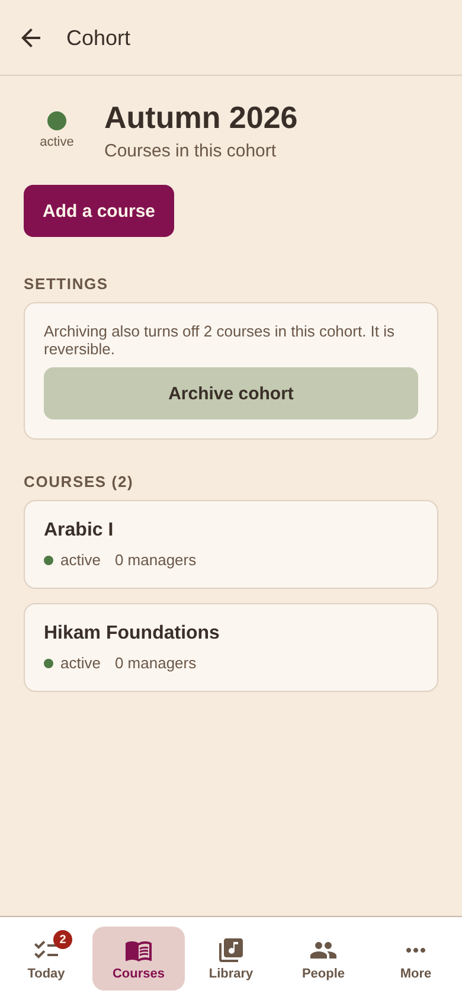<figcaption>On a phone</figcaption></figure>
<figure class="wd">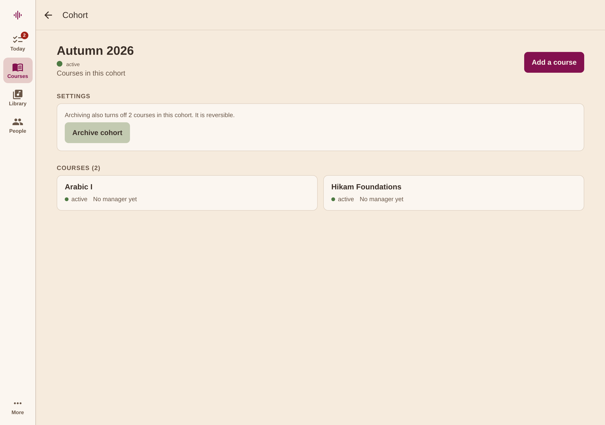<figcaption>On a computer</figcaption></figure>

The **course page** is your dashboard for that course:

<figure class="ph">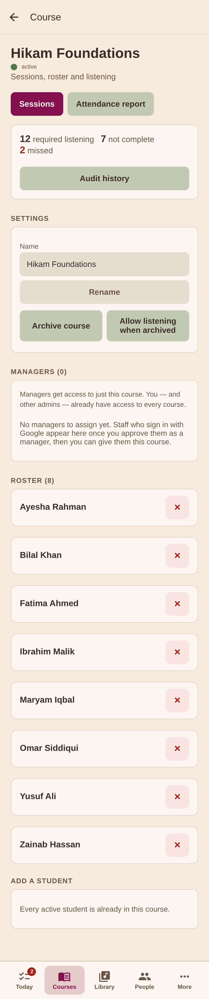<figcaption>On a phone</figcaption></figure>
<figure class="wd">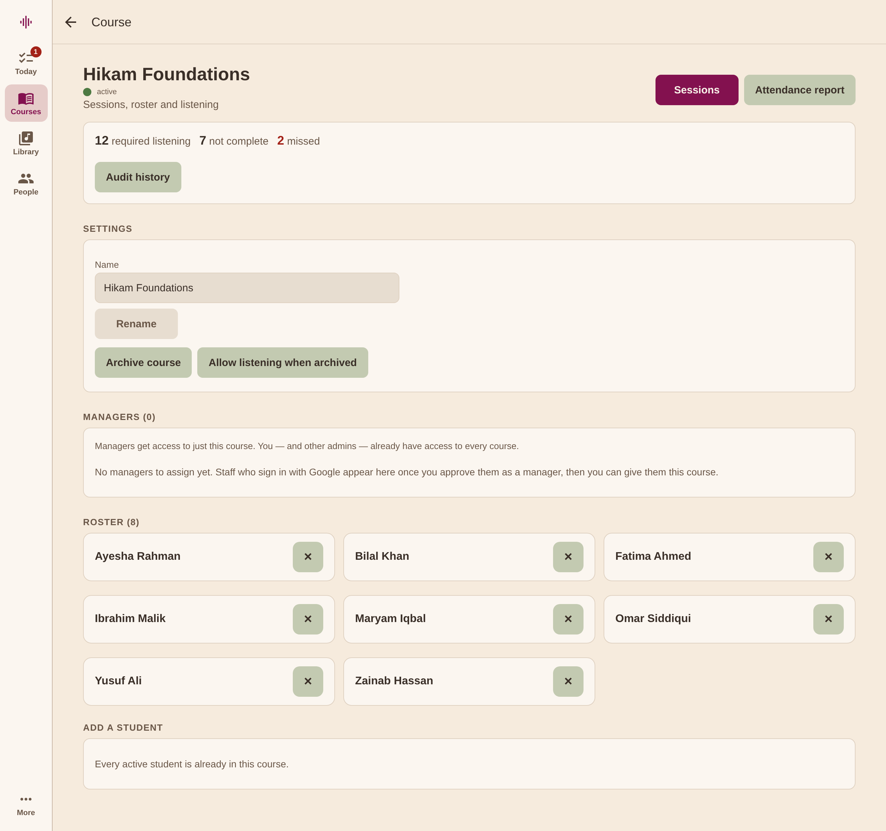<figcaption>On a computer</figcaption></figure>

- **Sessions** takes you to the course's meetings, where attendance and
  recordings live (Section 2.4).
- **Attendance report** summarizes attendance and catch-up across the whole
  course (Section 2.9).
- The counts card — *N required listening / not complete / missed* — is the
  whole course's required listening at a glance, and links straight to the
  course **Audit history**.
- **Settings** lets you rename the course, **archive** it when the term ends, and
  choose whether students may still listen to an archived course's recordings.
- **Managers** lists the staff assigned to *this* course. Managers only ever see
  and act on the courses they're assigned to here — being in a cohort grants
  nothing by itself.
- **Roster** lists the enrolled students. Tap a student to see their personal
  ledger for the course (Section 2.8).

## 2.4 Sessions, attendance, and adding a recording

<figure class="ph">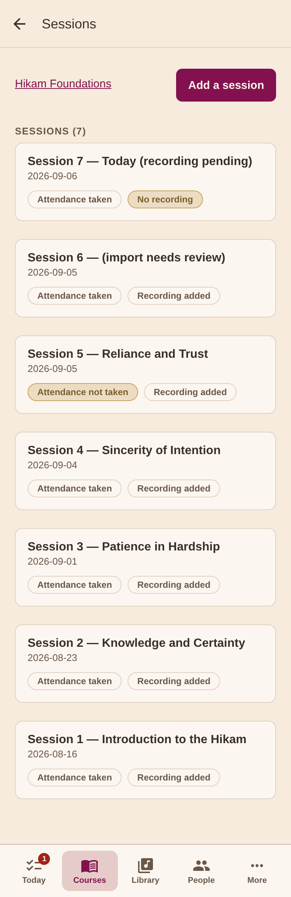<figcaption>On a phone</figcaption></figure>
<figure class="wd">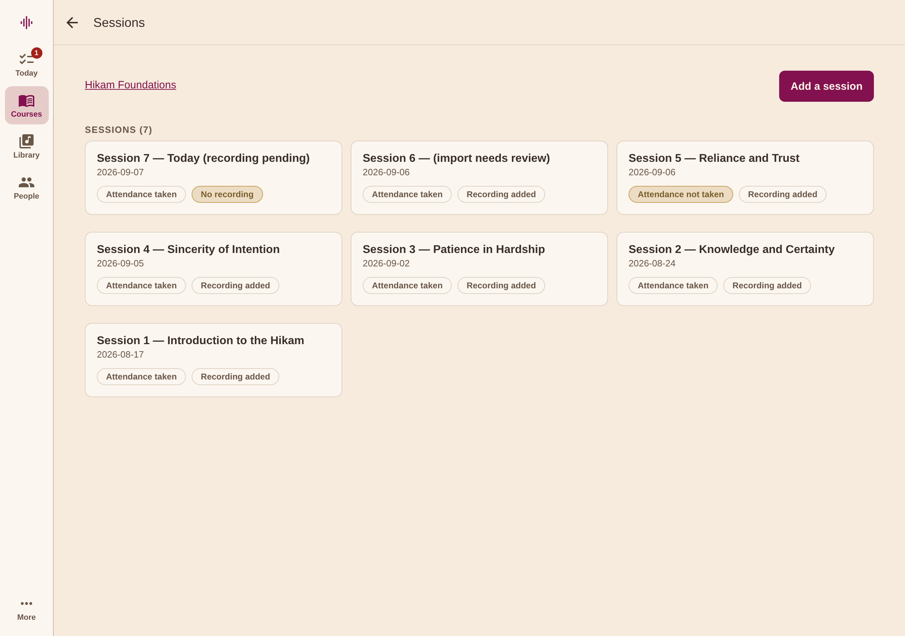<figcaption>On a computer</figcaption></figure>

A **session** is one class meeting. Create one for each meeting — give it a
title, its date, and a **Listen by** date. Each session card shows at a glance
whether **attendance** has been taken and whether a **recording** has been added,
so you can see what's still outstanding.

**The "Listen by" date is required, and it matters more than it looks.** It is
the day the recording *closes* to the students you excused — after it, they can
no longer play it. It fills in automatically as a week after the meeting (or
today, if the meeting was long enough ago that a week later has already been and
gone); change it to whatever suits. You can't *move* it into the past, and you
can move it forward later to reopen a session for someone who needs longer.
Everything else about a closed session stays editable — fix a title or a date on
a session whose Listen by date has passed and the date simply stays as it is.

The **course name under the heading is a link** — on the sessions list, on a
session, and on the attendance report. Tap it to go straight back to the course.
The back arrow takes you one step back the way you came; this takes you to the
course itself, however many steps in you are, and it works even when you have
opened a session from a link somebody sent you.

Open a session to work with it:

<figure class="ph">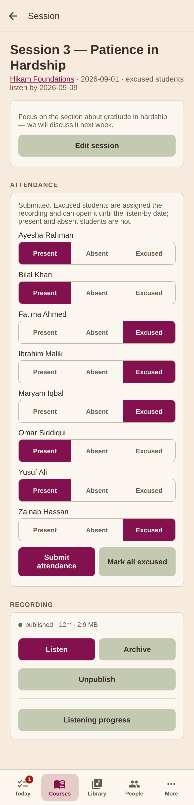<figcaption>On a phone</figcaption></figure>
<figure class="wd">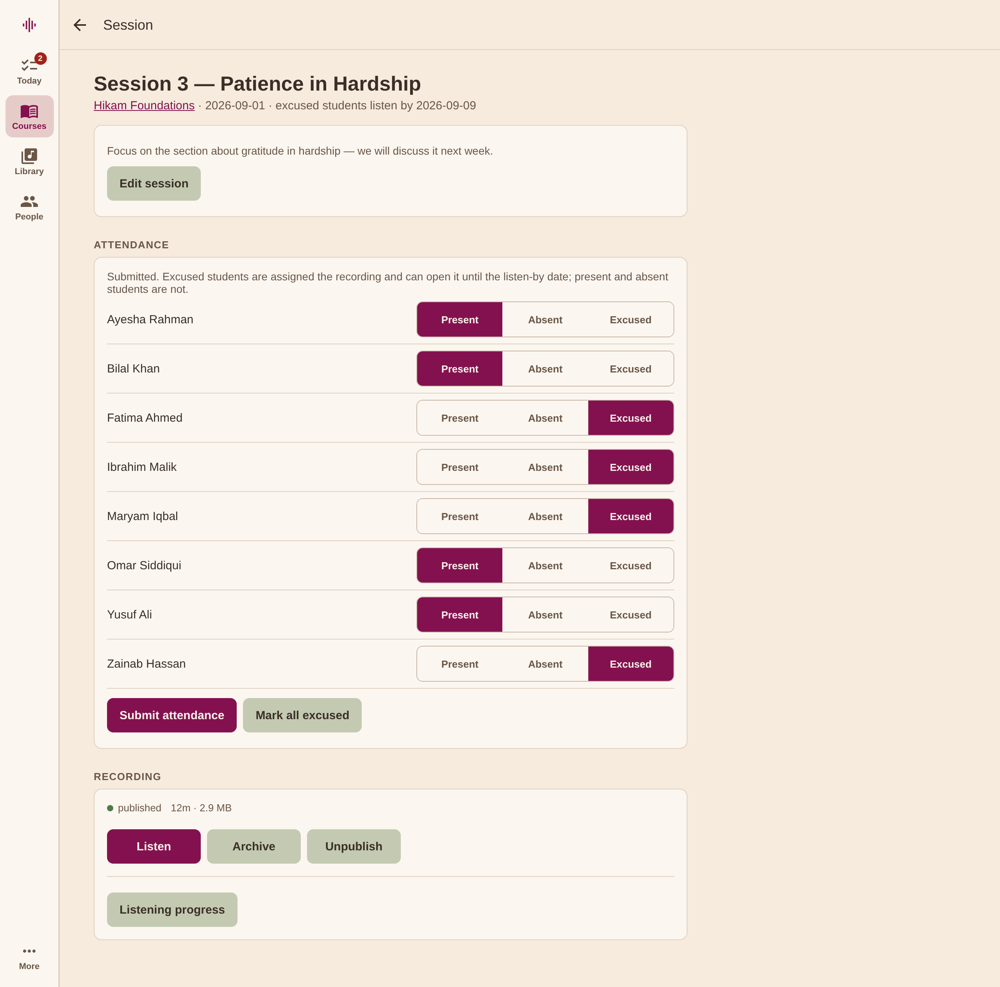<figcaption>On a computer</figcaption></figure>

**Take attendance.** For each enrolled student, choose **Present**, **Absent**,
or **Excused**, then tap **Submit attendance**. Everyone starts as *Present*, so
often you only flip the few who missed. You can re-submit a corrected attendance
later and everything updates automatically.

**Excusing a student is what gives them the recording.** It is the only mark that
does:

- **Present** — they were there. Nothing is required of them, and the recording
  is not opened to them.
- **Excused** — they missed it with your permission. The recording opens to them
  and listening to it is required, until the Listen by date.
- **Absent** — they missed it without being excused. Nothing is opened to them.

So **Mark all excused** is the one-tap shortcut for "everyone must listen to this
one." And if someone genuinely needs to catch up on a class you marked them
absent for, just change their mark to Excused and submit again.

One limit worth knowing: you can't excuse anyone *new* for a session whose Listen
by date has already passed — it would hand them something they could never open.
Move the date forward first, then excuse them. Correcting a closed session in
every other way still works, including changing someone from excused to present
or absent, so the attendance record never becomes uncorrectable.

**Add the recording.** In the same screen, **Upload audio…** or import it from
Zoom. It's **audio only** — up to 300 MB, though a two-hour class is normally
well under 30 MB. (Uploading audio rather than a video file is the single biggest
thing that keeps this app free to run.) The recording takes its title, date, and
notes from the session, so you don't retype them.

**Or say it wasn't recorded.** Some classes aren't, and until you say so the app
keeps asking: **Today** shows the session as waiting for its recording, and you
get the "attendance still not taken" reminder every morning. **This class was not
recorded** stops both. It changes nothing else — the register stays exactly as it
is, and the marks in it still count — and **It was recorded after all** puts the
session back if you change your mind.

<figure class="ph">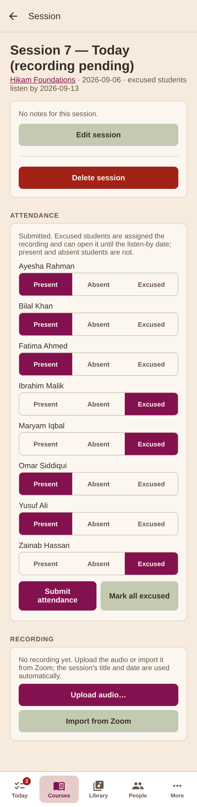<figcaption>On a phone</figcaption></figure>
<figure class="wd">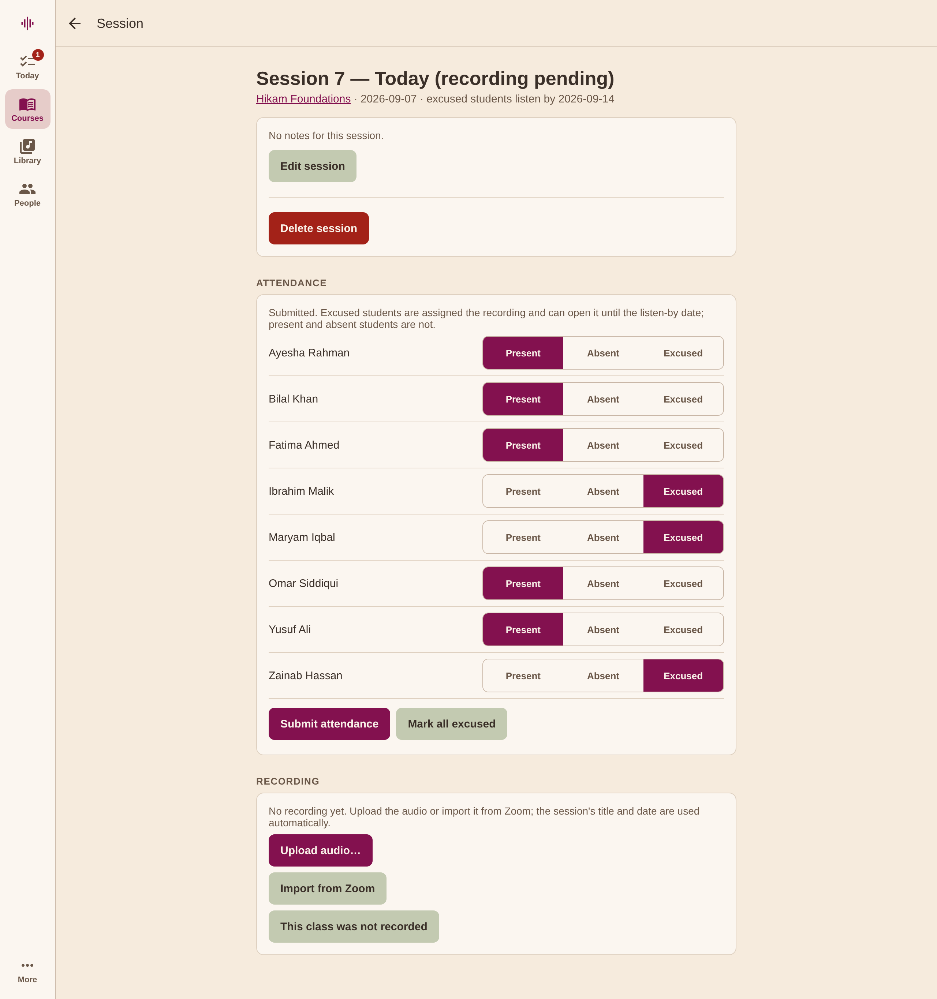<figcaption>On a computer</figcaption></figure>

Each recording moves through a few states:

- **Draft** — added, not yet visible to students. You can replace its audio
  freely.
- **Published** — live. The students you excused can now listen, and are on the
  hook for it. Publishing is blocked if the session's Listen by date has already
  passed, because nobody would be able to open it.
- **Needs attention** — flagged for a problem (for example, a Zoom import that
  needs review). Publish is blocked until it has audio.
- **Unpublished** — pulled back from students after being live. It goes back to
  Draft to be fixed, then out again.
- **Archived** — filed away at the end of a term. Like unpublishing, it closes
  the recording to everyone who was excused, so **Today** raises it if you
  archive one whose Listen by date has not passed yet. One tap puts it back —
  while that date is still ahead. Once it has passed, Publish is greyed out and
  the card says why: publishing then would give nobody access, so move the
  session's **Listen by** date forward first, which reopens it for everyone
  excused. Archiving at the end of a term, after the dates have gone, is
  therefore filing rather than something to undo.

## 2.5 How a recording becomes required listening

Here's the rule that runs the whole ledger:

> **A recording opens to the students marked EXCUSED for its session, and to
> nobody else** — automatically, once the recording is **published** and its
> attendance has been **submitted**. The same fact makes listening required.
> It closes again when the session's **Listen by** date passes.

You never assign students one by one; the attendance sheet is the assignment. If
you correct attendance — flip someone from excused to present, or the reverse —
access and obligations update to match, and any listening or completion already
recorded is kept.

- **Being enrolled opens nothing.** A student in the class who was present, or
  absent without being excused, cannot play the recording at all.
- **The Listen by date closes it.** After that day the student sees the recording
  on their list marked *Missed*, with the date it closed, and can no longer play
  it. Move the session's Listen by date forward to reopen it.
- **A student who joins late** wasn't on the roster when earlier attendance was
  taken, so they are **not** retroactively given those older sessions. On an
  earlier session's register they appear as *not marked* — correcting somebody
  else's mark there leaves them that way. If you *do* want a latecomer to catch
  up on an earlier one, open that session, mark them **Excused**, and re-submit
  attendance.
- **Unpublishing** a recording closes it to everyone again.

## 2.6 The recording ledger — who has caught up

<figure class="ph">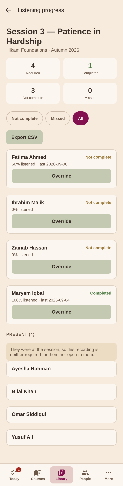<figcaption>On a phone</figcaption></figure>
<figure class="wd">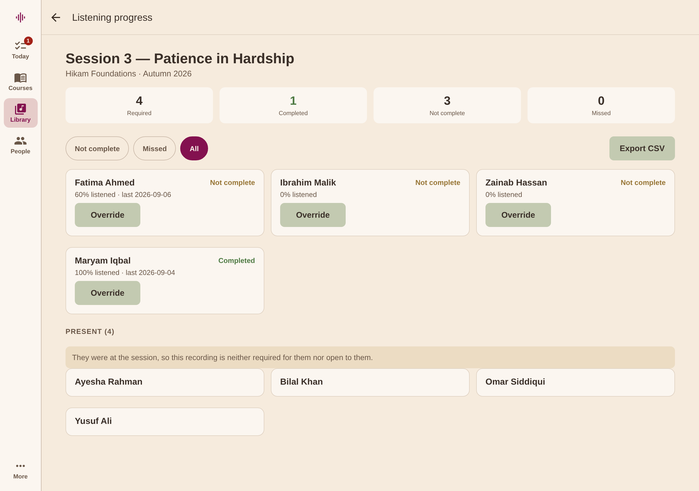<figcaption>On a computer</figcaption></figure>

Open a published recording's **Listening progress** (from its session) to see
exactly where things stand. Up top, four counts: **required** (the students you
excused, the only ones who can open it), **completed**, **not complete**, and
**missed**.

The screen has five parts:

- **The required list** — the students you excused, each with how much they've
  listened, when they last listened, and their status: **Completed**,
  **Not complete**, or **Missed**. The **filter chips** — *Not complete / Missed
  / All* — open on **Not complete**, so you land on exactly the people who still
  need a nudge.
- **Present** — the students who were there. The recording is neither required
  for them nor open to them.
- **Absent** — marked absent rather than excused, so it was never opened to them.
  To let one of them catch up, mark them **Excused** on the session and submit
  again.
- **Excused, access closed** — students you excused whose access has since been
  withdrawn: they were unenrolled from the class, or the recording was
  unpublished or archived. Nothing is required of them and they can't open it.
  Re-enrolling them, or publishing the recording again, restores it — for
  anything still inside its **Listen by** date. A session whose date has already
  passed stays closed, so nobody comes back to an obligation they had no chance
  to meet.
- **Also listened** — listening from someone who no longer holds the recording,
  for example a student you excused, who listened, and whom you then corrected to
  present. Kept as history.

**Export CSV** downloads the required rows — the same rows, the same filter —
as a spreadsheet, for records or a follow-up.

## 2.7 Overriding a completion

<figure class="ph">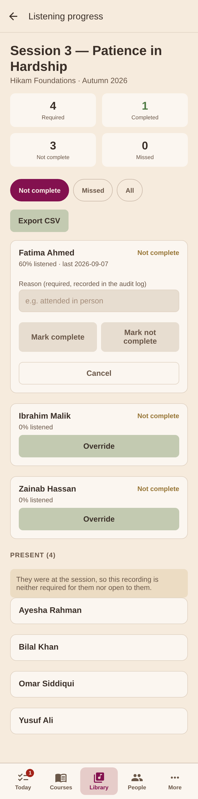<figcaption>On a phone</figcaption></figure>
<figure class="wd">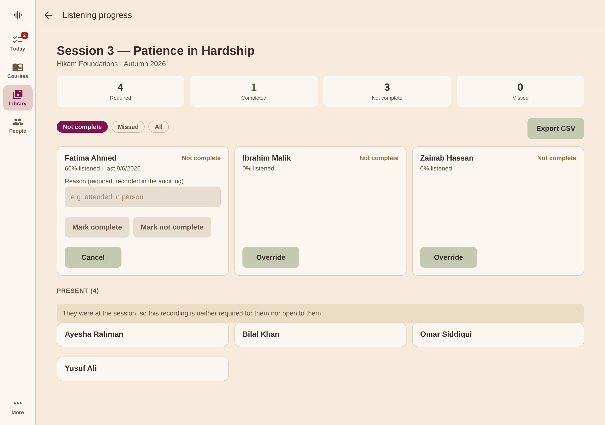<figcaption>On a computer</figcaption></figure>

Sometimes the ledger and reality differ — a student caught up in person, or
listened on someone else's device. Tap **Override** on their row to set the
status yourself:

- Enter a **reason** — it's **required**, and it's written into the audit history
  so there's always a record of why. "Caught up with the teacher one-on-one" is a
  good example.
- Choose **Mark complete** or **Mark not complete**.

An override **wins over the student's own mark**. If you mark someone complete and
they later fiddle with their own status, your override stands. To undo it, open
the row again and **Remove override** — the status falls back to whatever the
student's own listening says. Every override, and every removal, is audited.

**The student sees it too**, with the reason you typed — on their player, in
their list, and in what the app counts as outstanding. Somebody you have marked
complete stops being asked to listen and stops getting the last-day reminder, and
they cannot unmark what you set. Write the reason for them as much as for the
record: "Caught up with the teacher one-on-one" is read by the person it is
about.

## 2.8 One student's ledger

From a course's **Roster**, tap a student to see *their* view: the recordings
they're required to listen to in that course, each with its status, the same
action-first filters, and its own **Export CSV**. It's the per-person counterpart
to the per-recording ledger in 2.6 — the right screen when a parent or student
asks "where do I stand?"

## 2.9 The attendance report

<figure class="ph">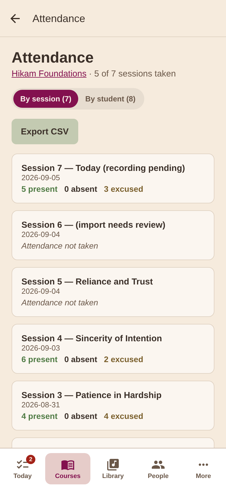<figcaption>On a phone</figcaption></figure>
<figure class="wd">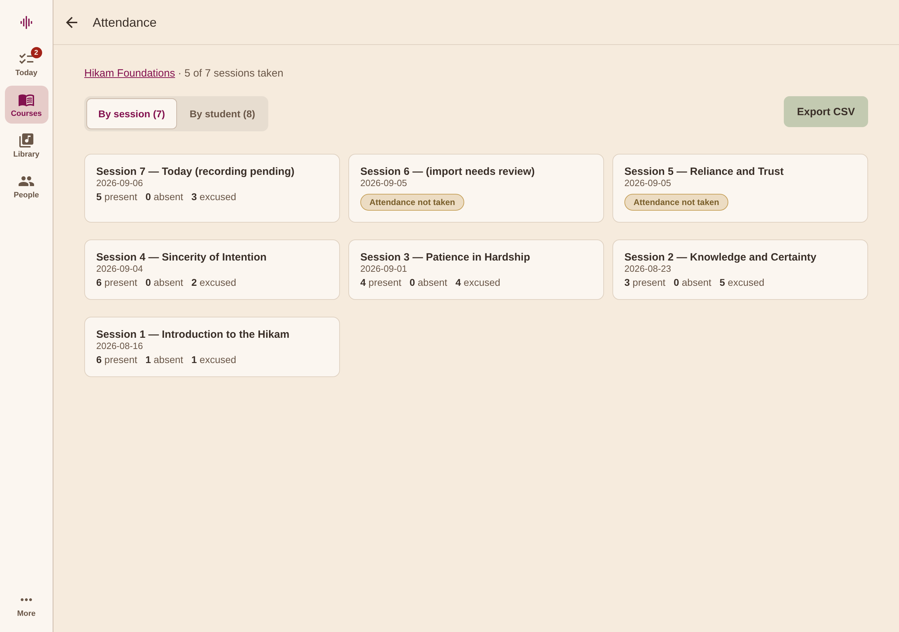<figcaption>On a computer</figcaption></figure>

Reached from the course page, the **attendance report** rolls the whole course up
two ways — a toggle switches between them:

- **By session** — every session with its present / absent / excused counts, and
  a clear flag on any meeting where attendance was never taken.
- **By student** — each student's attendance across the course (chronic absentees
  first), plus their **catch-up** status: of the recordings they were excused
  from, how many are complete and how many they missed.

Each view has its own **Export CSV**.

**Tap any card to go straight to the detail.** A session opens that session — its
attendance roster and its recording; a student opens that student's listening
progress for the course. So the report is where you spot the problem, and one tap
is where you deal with it.

## 2.10 The recording library

<figure class="ph">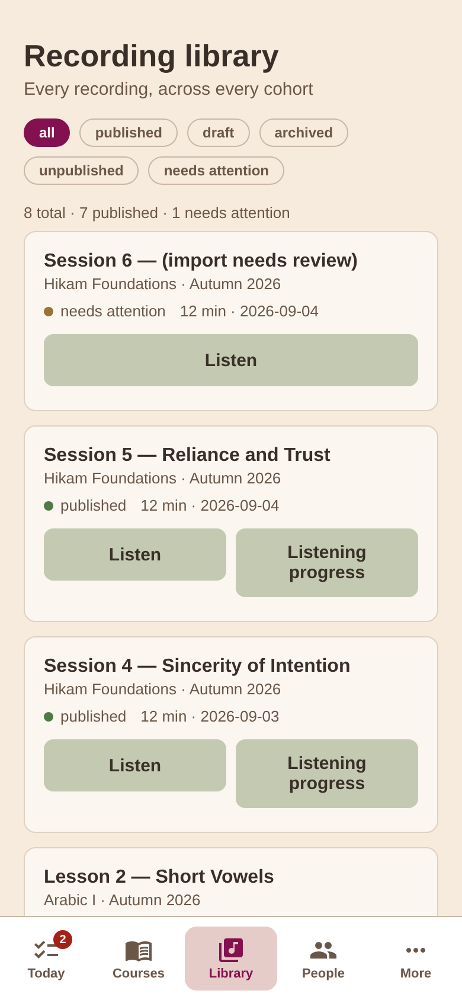<figcaption>On a phone</figcaption></figure>
<figure class="wd">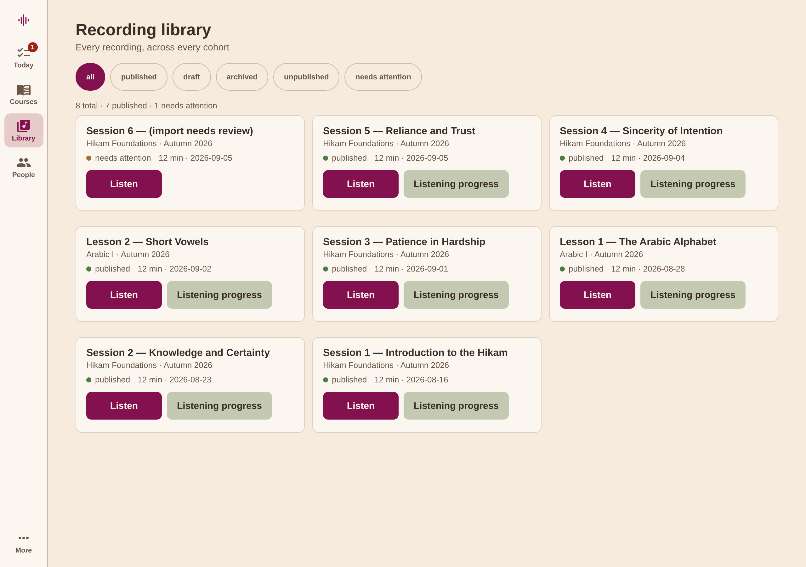<figcaption>On a computer</figcaption></figure>

The **library** is every recording you can see, across all your courses, in one
list — with a count summary and filters for **published / draft / archived /
unpublished / needs attention**. It's the fastest way to answer "which recordings
still need audio?" or "what's flagged?" without walking course by course. Admins
see everything; managers see their assigned courses.

Two dropdowns narrow the list by where a recording belongs. Choose a **cohort**
and leave the course alone to see everything in that term; choose a **course**
as well to see just that course. The course list offers the courses in the
cohort you chose — or every course, each with its term, when no cohort is
chosen — and the count line describes whatever you have narrowed to. **Clear
filters** appears whenever something is narrowing the list and puts everything
back.

## 2.11 People — managing students

<figure class="ph"><figcaption>On a phone</figcaption></figure>
<figure class="wd"><figcaption>On a computer</figcaption></figure>

**People** holds both populations. Admins get a **Students / Staff** switch above
the list; managers see the student directory and no switch, because approving
staff isn't theirs to do. The directory is the whole institute for every staff
member — a manager can look someone up before enrolling them, which they could
not do if the list were cut to the courses they already run. What a manager
cannot see is anyone's *progress* outside their own courses: open a student and
the page shows only the courses that manager runs.

To add a student, tap **Add a student**, enter their **full name** and **email**,
optionally **enrol them in a course** right away, and tap **Create account**. The
app emails them a link to set their own password — you never handle passwords.
The course list offers only courses that are running; an archived course, or one
in an archived cohort, is not listed there (you can still enrol someone into it
from the course's own page).

**Creating accounts is done on the website, not in the phone apps.** The
**Add a student** button in the figures above is a capture of the website at a
phone's width; in the Android app it is simply absent. This is a store
requirement rather than a limitation we chose, and it only affects *creating* —
changing roles, disabling an account and enrolling someone all work everywhere.

The list itself is just for finding someone. **Tap a student to open their
page**, where everything about them lives. Students you've disabled move out of
the main list into a **Disabled** section at the bottom — tap the heading to
open it.

### A student's page

<figure class="ph">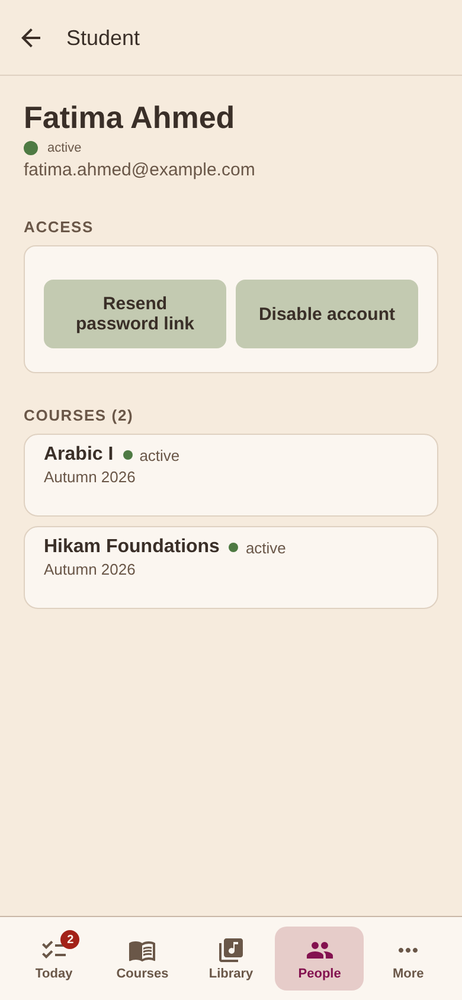<figcaption>On a phone</figcaption></figure>
<figure class="wd">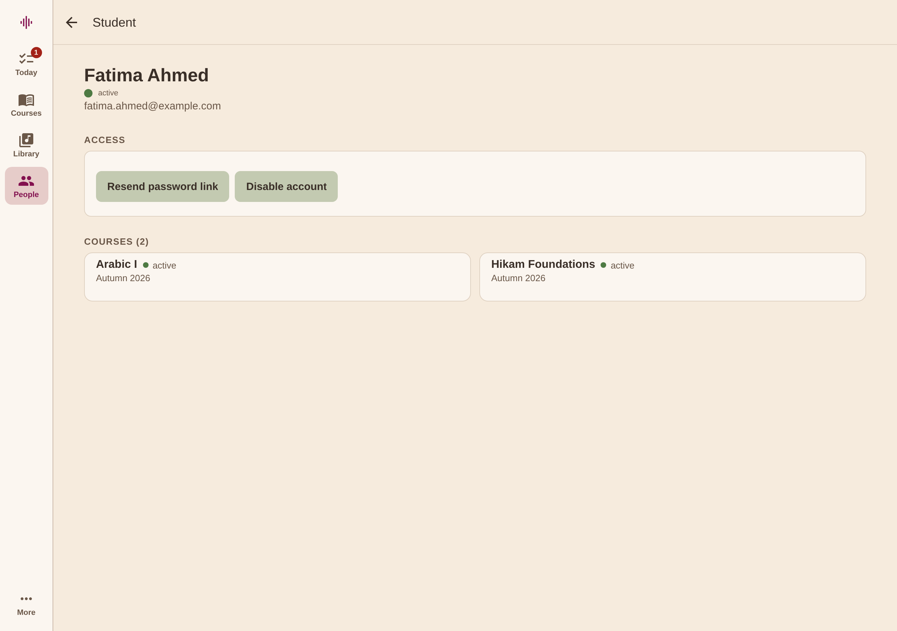<figcaption>On a computer</figcaption></figure>

It shows their name, address and whether they're **active** or **disabled**, and
carries the two actions:

- **Resend password link** — if they lost the email or the link expired.
- **Disable account** — turns off access without deleting anything. (Disable,
  don't delete — deletion is a separate, deliberate, admin-only step.) Admins
  only; managers see the state but not the switch, because access spans every
  course.

Below that are **the courses they're in**. Tap one to open that student's
listening progress for it.

If you're a **manager**, this lists the courses *you* manage — it's headed
**Courses you manage** to say so. You aren't shown classes you don't run, so
treat it as your view of the student rather than their whole record. An admin
sees every course.

**History**, at the bottom, is the student's record from the day the account
was created: when it was made and by whom, then every enrolment, removal and
return, and every time the account was disabled or re-enabled — each with who
did it and when, in the institute's time. It is read from the same audit
history admins see (Section 3.3), so nothing here is a second record. A manager's
list covers the courses they manage; account changes are admin-only, and an
admin sees everything.

---

## 2.12 Notifications *(staff)*

Tap **More**, then **Notifications**. Managers get one message:

- **Attendance still not taken** — a couple of days after a class meeting whose
  attendance you never submitted.

It goes to the people who manage the class, so if you manage none — which is
usual for an administrator — you have no switches here, and the screen says so.
A session marked **not recorded** stops sending it.

It's more useful than it sounds. Until attendance is submitted nobody has been
excused, so a recording you've already published is sitting there that not one
student can open. **Today** shows the same thing in the app, with a count on the
tab, so this message is a nudge rather than the only warning.

Reaching this device needs its permission as well. The app offers to set that up
once, on Today after you sign in; you can also tap **Enable notifications** on
this screen at any time. If it says they are blocked, use
**Open settings** on a phone, or allow them from the site settings behind the
icon in your browser's address bar.

---

# Part 3 — For admins

## 3.1 Approving staff

<figure class="ph"><figcaption>On a phone</figcaption></figure>
<figure class="wd"><figcaption>On a computer</figcaption></figure>

Open **People** and switch to **Staff**. New staff who sign in with Google land
in **Waiting for approval**. For each, you choose the role as you approve:

- **Approve as manager** — they can run the courses you later assign to them.
- **Approve as admin** — full access, including approving other staff.

Below, **Staff** lists everyone with access. Your own account is marked "This is
you" — you can't change your own role or access, which stops an admin from
accidentally locking themselves out. Staff you've disabled move out of that
list into a **Disabled** section at the bottom, exactly as disabled students
do — tap the heading to open it, and **Re-enable** is still on the card.

Only staff on the institute's own Google domain can be approved at all — the app
checks this on the server, not just in the browser.

## 3.2 Managers are scoped course by course

A manager can't see anything until you give them a course. Do that on the
**course page** (Section 2.3), under **Managers** — add them there, and they'll
see that course's sessions, recordings, ledgers, attendance, and audit, and
nothing else. Putting a course in a cohort a manager works in does *not* grant
access; the assignment is always the specific course.

## 3.3 The audit history

<figure class="ph">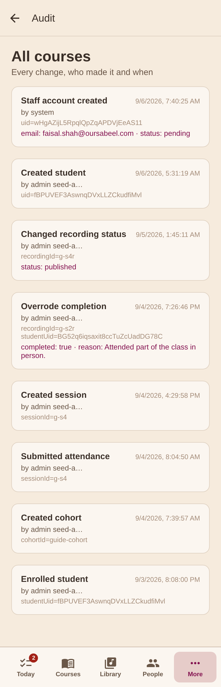<figcaption>On a phone</figcaption></figure>
<figure class="wd">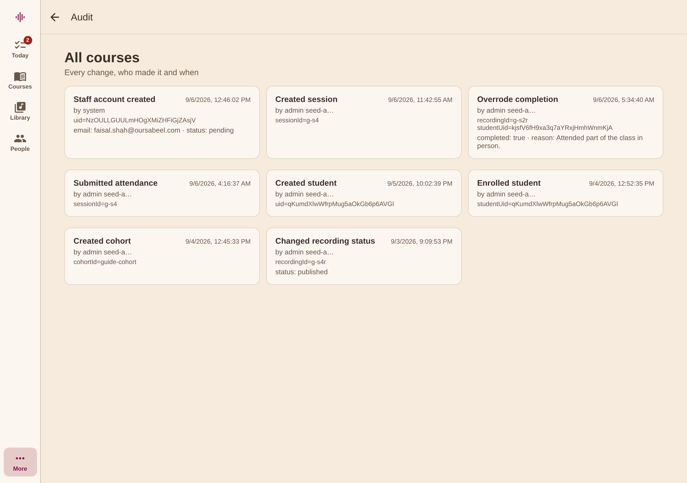<figcaption>On a computer</figcaption></figure>

The **audit history** is the running record of consequential actions — staff
approvals, attendance submissions, completion overrides (with their reasons),
recording edits — newest first. Each entry shows *who* did *what*, *when*, and the
details that matter.

You can reach it two ways: **globally** from **More → Audit history** (admins,
all courses), or **scoped to one course** from that course's page (managers see
their own courses' history). It's there so that "who marked this complete, and
why?" always has an answer.

Times are the institute's, not your device's — the same clock as every **Listen
by** date, so the two are comparable wherever you are reading from. The screen
shows a fixed number of the most recent changes and says how many when it is
full; nothing is deleted, and older history is still in the record.

## 3.4 Disable and archive — don't delete

The app is built around **reversible** actions:

- **Disable** a student or staff member to switch off access while keeping their
  history.
- **Unpublish** a recording to pull it from students without losing it, or
  **archive** it once a term is over. Both close it to the students who were
  excused; archiving is the one you reach for when nothing is wrong.
- **Archive** a course when a term ends — its history stays intact, and you
  decide whether students may still listen to it.

Permanent deletion exists, but it's deliberately admin-only, asks for strong
confirmation, and is audited. Reach for disable, unpublish, or archive first.

---

# Part 4 — "How do I…?" quick answers

| I want to… | Do this |
|---|---|
| **Listen to something I missed** | **Listening** → tap the card → big round button. |
| **Pick up where I left off** | Just reopen it — your place is saved automatically, on any device. |
| **Slow down or speed up** | Tap **1×–2×** on the player. |
| **Mark something done** | Press play once, then **Mark complete** at the bottom of the player. |
| **See my attendance for a class** | **Classes** → tap the class. |
| **Set my student password** | Open the emailed link, or tap **Email me a password link** on sign-in. |
| **Add a session** *(staff)* | Course → **Sessions** → **Add a session** → title + date → **Create session**. |
| **Take attendance** *(staff)* | Session → mark Present / Absent / Excused → **Submit attendance**. |
| **Add a recording** *(staff)* | Open the session → **Upload audio…** (or import from Zoom). |
| **Open a recording to students** *(staff)* | Mark them **Excused**, then **Publish** — that is the whole of it. |
| **Change the closing date** *(staff)* | Session → **Edit session** → **Listen by**. Moving it forward reopens a closed recording. |
| **See who's behind** *(staff)* | Session → **Listening progress** → **Not complete** / **Missed**. |
| **Give someone credit anyway** *(staff)* | Ledger → **Override** → reason (required) → **Mark complete**. |
| **Make a latecomer catch up on an old session** *(staff)* | Open that session → mark them **Excused** → **Submit attendance**. (Move **Listen by** forward first if it has passed.) |
| **See course attendance** *(staff)* | Course → **Attendance report** (toggle by session / by student). |
| **Export for records** *(staff)* | Any ledger or the attendance report → **Export CSV**. |
| **Turn a notification off** | **More** → **Notifications** → tap the one you don't want. |
| **Approve a new teacher** *(admin)* | **People** → **Staff** → **Approve as manager / admin**. |
| **Give a manager a course** *(admin)* | Course page → **Managers** → add them. |
| **Create a student** *(staff)* | On the website: **People** → **Add a student** → name + email → **Create account**. |
| **See who changed what** *(admin)* | **More** → **Audit history**. |

## Troubleshooting

**I signed in but I'm stuck on an "approval" screen.** *(Staff)* New accounts wait
for an admin to approve them. The screen updates by itself the moment they do — no
refresh needed. If you're stuck, contact your administrator.

**A student can't sign in.** Check the email address matches the one on their
account exactly, then open their page from the People screen and use
**Resend password link** so they can set a fresh password. New students have no password until they use that link.

**The audio won't play.** Streaming needs a working connection — try switching
between Wi-Fi and mobile data. Play links refresh automatically, so simply
reopening the recording usually clears a stale one.

**A student says they shouldn't be on the hook for a recording.** Check that
session's attendance — required listening follows it. If they were there, mark
them **Present** and re-submit; the obligation drops (and any listening they did
is kept). If they genuinely missed it, that's exactly what the required listing
is for.

**I marked something complete but it still shows incomplete.** If you were
offline, the app is holding your mark and will sync it once you're back online;
it may briefly show as pending. If a *teacher* has overridden your status, their
mark takes precedence — that's by design.

**A manager can't see a course.** Managers only see courses they're assigned to.
An admin adds them under **Managers** on the specific course page — being in the
cohort isn't enough.

**Where did a recording go?** It may have been **unpublished** (back to draft) or
its course **archived**. Both are reversible — check the session or the course
settings. If the session's **Listen by** date has passed, move it forward before
publishing again; the card on the session says so.
