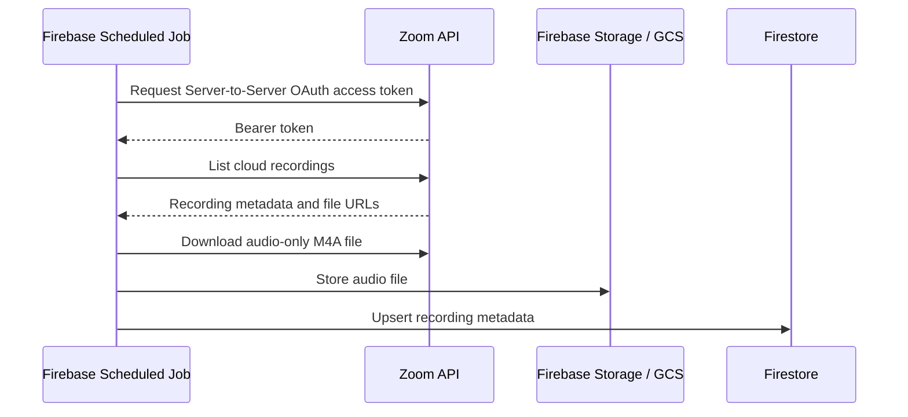

# Zoom Server-to-Server OAuth Research

## Bottom line

For recordings owned by one Zoom account you control, use a private/internal **Server-to-Server OAuth** app created in the Zoom App Marketplace developer portal. The app does not need to be publicly published in the Marketplace.

Use a user-authorized OAuth app only if independent Zoom account owners need to connect their own accounts.

## Source links

- [Create an internal Zoom app](https://developers.zoom.us/docs/internal-apps/create/)
- [Server-to-Server OAuth](https://developers.zoom.us/docs/internal-apps/s2s-oauth/)
- [Zoom OAuth overview](https://developers.zoom.us/docs/integrations/oauth/)
- [Zoom Meeting Recording API reference](https://developers.zoom.us/docs/api/rest/reference/zoom-api/methods/#tag/Cloud-Recording)
- [Zoom cloud recording storage capacity](https://support.zoom.com/hc/en/article?id=zm_kb&sysparm_article=KB0067670)

## What the app needs from Zoom

If you can sign in to Zoom and see cloud recordings, the account has cloud recording enabled. The backend still needs API authorization through a Zoom app with recording-related scopes.

For a single owned Zoom account:

1. Sign in to the Zoom App Marketplace developer portal.
2. Choose **Build App**.
3. Choose **Server-to-Server OAuth**.
4. Create the app as an internal/private app.
5. Add the recording read scopes needed to list and retrieve cloud recordings.
6. Copy these values into Firebase Secrets / Secret Manager:
   - Zoom account ID
   - Zoom client ID
   - Zoom client secret

## Token flow

The Firebase backend requests an access token from Zoom:

```text
POST https://zoom.us/oauth/token
grant_type=account_credentials
account_id={ZOOM_ACCOUNT_ID}
Authorization: Basic base64({ZOOM_CLIENT_ID}:{ZOOM_CLIENT_SECRET})
```

Zoom returns a short-lived bearer token, typically valid for one hour. Server-to-Server OAuth does not require a refresh token flow; the backend requests a new access token when needed.

## Recording sync flow



## Relevant recording API behavior

Zoom cloud recording metadata can include recording files with fields such as:

- `file_type`
- `file_extension`
- `recording_type`
- `download_url`
- `play_url`
- `recording_start`
- `recording_end`
- `status`

The desired file is the audio-only recording, typically M4A/AAC. If audio-only files are not present for older recordings, either enable audio-only recording going forward or extract audio server-side from the MP4.

## Marketplace publication

Creating the app in the Zoom App Marketplace developer portal does not mean the app must be publicly listed. For this use case, keep it internal/private.

Public Marketplace review/publication is relevant when other Zoom customers need to discover, install, and authorize the app against their own Zoom accounts.

## Security requirements

- Store Zoom credentials only in Firebase Secrets / Secret Manager.
- Do not put Zoom credentials in the mobile app.
- Do not expose Zoom access tokens or Zoom download tokens to students.
- Let the backend fetch from Zoom and copy only the needed audio file into Firebase Storage/GCS.
- Serve the app from Firebase-controlled access paths rather than raw Zoom recording URLs.

## Zoom-side cost notes

Basic API access is generally included with paid Zoom plans that support cloud recording. The relevant Zoom-side cost risk is cloud recording storage. If recordings are synced into Firebase/GCS and old Zoom recordings are deleted or auto-deleted according to policy, Zoom storage use can stay controlled.

